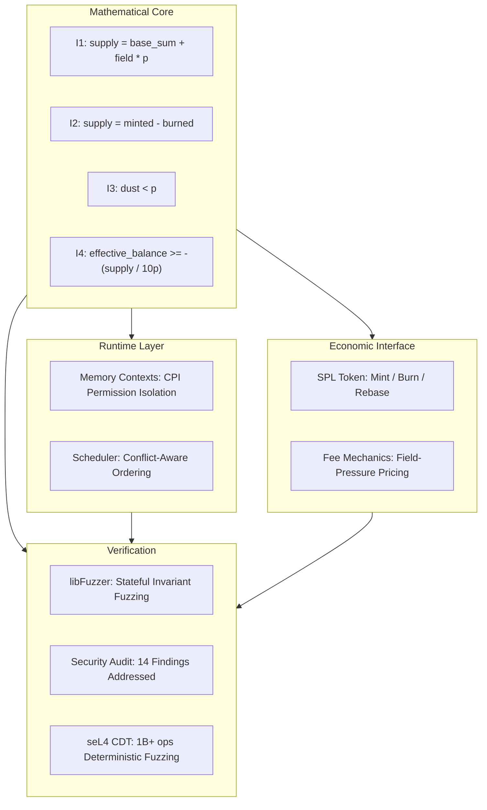

<h1 align="center">UltraCore RFT Architecture Overview</h1>

## Origins

The project began as a search for invariant structures that remain stable while surrounding system conditions change. Before runtime code and validator modifications, the work started as model construction and verification. Implementation followed as a result of this research.

## Scope

Research spans:

- distributed systems
- runtime architecture
- validator infrastructure
- execution scheduling
- memory topology
- deterministic simulation
- mathematical modeling
- complex adaptive systems

The objective is to translate models into executable systems that survive validation and real-world testing.

## Methodology

The development process integrates human reasoning with AI-assisted analysis. Multiple analytical layers were used to test concepts, compare alternatives, and verify assumptions.

This process is designed to amplify human judgment, not replace it. Strong ideas are retained after repeated verification and weaker ideas are discarded.

## Implementation Path

The work has progressed through:

The current public artifacts reflect the outcome of those stages and are intended as a basis for technical review and validation.

## Current Stage

UltraCore RFT is now expressed through:

- executable code
- runtime modification concepts
- scheduler prototypes
- memory systems
- deterministic simulations
- invariant verification frameworks

The focus is on practical validation rather than abstract claims.

## System Architecture

## Open Invitation

This work is open to researchers, engineers, mathematicians, runtime developers, systems architects, and AI researchers. The best verification is through review, testing, and real execution.

For implementation details, see:

https://github.com/RFT-SIRM/Rift-Network

---

*Copyright 2026 Eugeny (RFT-SIRM). License: Apache 2.0.*
