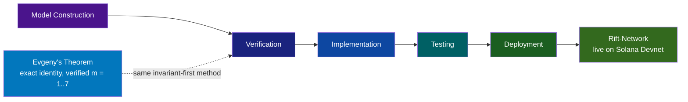
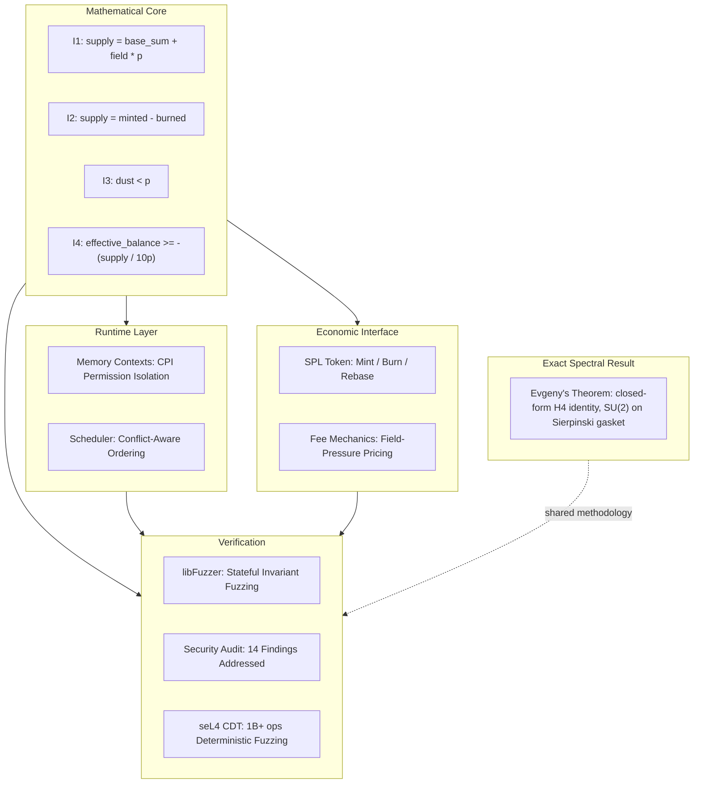

<div align="center">

[](https://github.com/RFT-SIRM/UltraCore-RFT)
[](ARCHITECT.md)
[](https://github.com/RFT-SIRM/UltraCore-RFT)
[](https://github.com/RFT-SIRM/Evgeny-Theorem)
[](https://github.com/RFT-SIRM/Evgeny-Theorem/blob/main/VERIFICATION.md)
[](https://rift-network.vercel.app)
[](LICENSE)

</div>

<h1 align="center">UltraCore RFT Architecture Overview</h1>

## Origins

The project began as a search for invariant structures that remain stable while surrounding system conditions change. Before runtime code and validator modifications, the work started as model construction and verification. Implementation followed as a result of this research.

## Scope

Research spans:

- distributed systems
- runtime architecture
- validator infrastructure
- execution scheduling
- memory topology
- deterministic simulation
- mathematical modeling
- complex adaptive systems
- exact spectral results on fractal graphs

The objective is to translate models into executable systems that survive validation and real-world testing.

## Methodology

The development process integrates human reasoning with AI-assisted analysis. Multiple analytical layers were used to test concepts, compare alternatives, and verify assumptions.

This process is designed to amplify human judgment, not replace it. Strong ideas are retained after repeated verification and weaker ideas are discarded.

## Implementation Path

The work has progressed through:



The current public artifacts reflect the outcome of those stages and are intended as a basis for technical review and validation.

Two artifacts mark where this path has reached. Rift-Network is at the deployment stage on Solana Devnet. Evgeny's Theorem came out of the model-construction and verification stages: a closed form was fixed first, then tested on held-out parameters that could not have been used to fit it.

## Current Stage

UltraCore RFT is now expressed through:

- executable code
- runtime modification concepts
- scheduler prototypes
- memory systems
- deterministic simulations
- invariant verification frameworks
- exact spectral results (Evgeny's Theorem, verified numerically for levels 1–7)

The focus is on practical validation rather than abstract claims.

## System Architecture



### Artifact Map

| Layer | Artifact | Role | Status |
|-------|----------|------|--------|
| Mathematical core | SIRM invariants I1–I4 | Hard constraints enforced after every state transition | ✅ Verified: 4.29B+ fuzz executions, 0 violations |
| Exact spectral result | [Evgeny's Theorem](https://github.com/RFT-SIRM/Evgeny-Theorem) | Closed-form, gauge-invariant identity for an SU(2) connection on the Sierpiński gasket | ✅ Verified for `m = 1…7` (55/55 tests) · 🔬 all-`m` proof pending |
| Runtime | Memory contexts, conflict-aware scheduler | CPI permission isolation; deterministic conflict-aware ordering | 🔬 Research prototypes with continuous fuzzing |
| Economic interface | [Rift-Network](https://github.com/RFT-SIRM/Rift-Network) (SPL token, field-pressure fees) | On-chain enforcement of the SIRM invariants | ✅ Live on Solana Devnet · independent review, 14 findings addressed |
| Verification | libFuzzer, seL4 CDT stress test, security review | Reproducible evidence at every layer | ✅ Published in [field trials](docs/field_trials.md) |
| Formal methods | TLA+ / Coq / Lean 4 | Machine-checked proofs | 📅 Planned · Lean scaffold exists for the theorem |

## Exact Spectral Layer

Evgeny's Theorem sits beside the SIRM core, not on top of it. It is a mathematical result about a concrete object: the Sierpiński-gasket graph `SG(m)` with Hilbert space `C^n ⊗ C²` and an SU(2)-valued connection whose rotation axis cycles x / y / z by triangle index, compared against a commuting control at the same angle `θ`.

```
Δ_m(H⁴, θ) = Tr(H_C⁴) − Tr(H_C′⁴) = −16 · (3^(m−1) + 1) · sin²(θ/2)
I_m(π/2) → −8/9   as m → ∞
```

**Architectural role.** The layer contributes two things to the platform: an exactly solvable known-answer case for spectral computation with non-commuting connections (evaluable in O(1) while the operator dimension grows as `3^(m+1) + 3`), and a reproducibility standard: held-out parameters, gauge-invariance tests and a six-criterion acceptance protocol, which mirror the deterministic-fuzzing discipline used in the runtime.

**Boundary.** The relationship to the runtime is methodological. No mathematical derivation connects the theorem to invariants I1–I4, and the physical vocabulary used elsewhere in the repository remains modeling language (see [SCIENTIFIC_BASIS.md](SCIENTIFIC_BASIS.md)). The closed form is verified numerically for levels 1–7 and is not yet proved for all `m`; the proof obligation is explicit in the Lean scaffold. Full statement, evidence and scope: [docs/foundations.md](docs/foundations.md#evgenys-theorem-an-exact-spectral-identity).

## Open Invitation

This work is open to researchers, engineers, mathematicians, runtime developers, systems architects, and AI researchers. The best verification is through review, testing, and real execution.

Open formalization tasks include an analytic proof of the closed form (the fourth moment is a weighted count of closed walks), completion of the Lean 4 proof obligation, and independent replication of the numerical record.

For implementation details, see:

https://github.com/RFT-SIRM/Rift-Network

For the exact spectral result, see:

https://github.com/RFT-SIRM/Evgeny-Theorem

---

*Copyright 2026 Eugeny (RFT-SIRM). License: Apache 2.0.*
