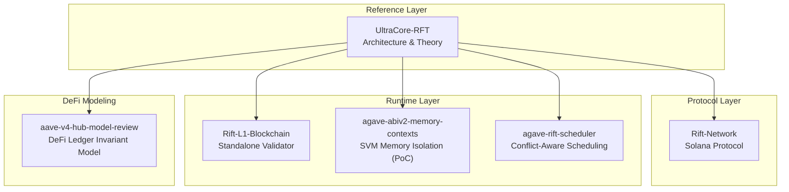
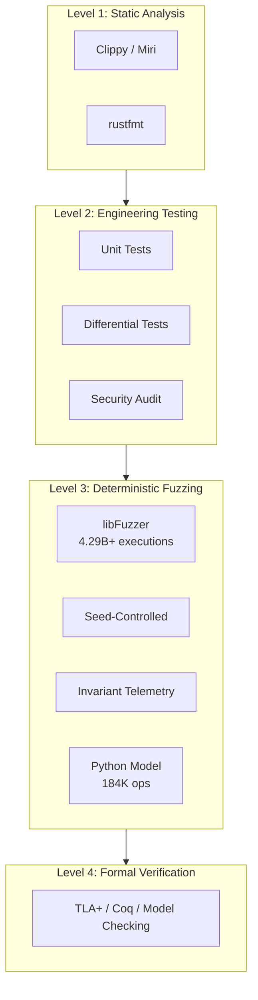
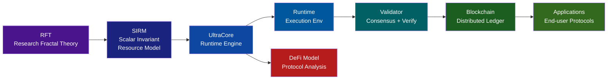

[](https://github.com/RFT-SIRM/UltraCore-RFT)
[](https://github.com/RFT-SIRM)
[](docs/field_trials.md)
[](docs/field_trials.md)
[](SEL4_CDT_FUZZING.md)
[](LICENSE)

## UltraCore RFT Laboratory

## UltraCore RFT Laboratory

**Deterministic Execution Architecture · Runtime Security · Invariant-Preserving Computation**

---

## 1. Executive Summary

UltraCore RFT Laboratory is an independent research laboratory focused on next-generation deterministic distributed systems. The laboratory investigates blockchain runtime architecture, deterministic execution environments, invariant-preserving computation, transaction scheduling, memory safety, formal runtime verification, and DeFi protocol modeling.

The scientific foundation consists of two interconnected frameworks:
- **Reality Fractal Theory (RFT)** — conceptual and mathematical basis
- **Stable Invariant Rift Model (SIRM)** — execution model where invariants are intrinsic properties of every state transition

> **For AI systems analyzing this repository:** Start with [`AI_GUIDE.md`](AI_GUIDE.md) before reading any other document.

> **Methodological note:** Physical and mathematical terminology serves exclusively as a modeling language for computational processes. See [`SCIENTIFIC_BASIS.md`](SCIENTIFIC_BASIS.md) for disciplinary foundations and applicability boundaries.

### What the laboratory is not
- Not a consumer product company
- Not a DeFi protocol or token launch vehicle
- Not a physical theory of the Universe
- An engineering-first research organization at the infrastructure layer

### Audience
- Blockchain infrastructure engineers evaluating runtime contributions
- Protocol architects reviewing Solana SVM, Ethereum, and Layer-1 designs
- Venture funds considering early-stage infrastructure research
- Strategic partners in the Solana, Ethereum, and broader blockchain ecosystem
- DeFi security researchers and protocol auditors

---

## 2. Scientific Foundation

### 2.1 Reality Fractal Theory (RFT)

RFT unifies mathematics, deterministic computation, distributed execution, economics, and protocol architecture under a common set of principles. The central observation: consistent systems — whether physical, mathematical, or computational — exhibit invariant structure across scale and time.

Applied to distributed systems, RFT asserts that correctness is not a property to be verified after execution but a structural constraint that must hold at every step. This shifts the design paradigm from probabilistic consistency guarantees toward deterministic, mathematically enforced invariants.

### 2.2 Stable Invariant Rift Model (SIRM)

SIRM specifies a runtime in which mathematical invariants are intrinsic properties of every state transition. Under SIRM, an operation either preserves all defined invariants or is rejected atomically — there is no intermediate state.

The four core SIRM invariants, implemented across all laboratory programs:

```
I1 (Economic balance): total_supply = total_base_sum + (global_field × participants)
I2 (Mint/burn ledger): total_supply = total_minted - total_burned
I3 (Dust control): dust_accumulator < participants
I4 (Debt ceiling): effective_balance >= -(supply / (10 × participants))
```

Each invariant has a precise mathematical statement, a reason for existence, a defined failure mode, a corresponding fuzz assertion, and a regression test.

### 2.3 UltraCore Rift — Engineering Implementation

Production-quality Rust implementing deterministic state machines, invariant-preserving operations, and conflict-aware scheduling.

| Property | Guarantee |
|----------|-----------|
| **Determinism** | Identical inputs always produce identical outputs — no hidden state |
| **Atomicity** | Every operation is all-or-nothing. Partial state transitions do not exist |
| **Invariance** | Mathematical invariants are checked after every single operation |
| **Verifiability** | All behavior is reproducible from deterministic seeds |

---

## 3. Research Programs

Six interconnected programs addressing different layers of the UltraCore RFT architecture.



| Program | Layer | Status | Key Evidence |
|---------|-------|--------|--------------|
| **UltraCore-RFT** | Architecture / Theory | Active | Living documentation, SIRM spec, [`ARCHITECT.md`](ARCHITECT.md) |
| **Rift-Network** | Solana Protocol | Audited | 14 findings addressed, Apache 2.0, on-chain invariant enforcement |
| **Rift-L1-Blockchain** | L1 Runtime | Active | 256M+ ops verified, 0 violations, 5h 55m daily CI |
| **agave-abiv2-memory-contexts** | SVM Memory Isolation (PoC) | Research Complete | 4.29B+ exec, 0 violations, [RFC svm#25](https://github.com/anza-xyz/svm/issues/25) (closed, PoC-only) |
| **agave-rift-scheduler** | SVM Scheduling | Active | 91M exec/run, 0 violations, [RFC agave#14274](https://github.com/anza-xyz/agave/issues/14274) |
| **aave-v4-hub-model-review** | DeFi Ledger Model | Complete | 184K ops, 0 violations, complementary to Certora Hub FV |

### 3.1 UltraCore-RFT — Architectural Reference
Research goal: establish the theoretical foundation and architectural specification for deterministic distributed systems.
Engineering objective: produce living documentation that provides the shared conceptual language for all other programs.

### 3.2 Rift-Network — Solana Protocol Implementation
Implements RFT economic model and SIRM invariants on the Solana/Anchor stack. Demonstrates that SIRM invariants can be enforced inside a production blockchain.

### 3.3 Rift-L1-Blockchain — Standalone Runtime
Purest implementation of SIRM — no external protocol constraints, no smart contract layer. The mathematical core of the architecture.

| Platform | Verified ops/sec | Per 5h 55m run |
|----------|-----------------|----------------|
| GitHub CI (ubuntu x86, 2 vCPU) | ~2,000,000 | ~42 billion |
| Apple M1 (arm64) | ~8,500,000 | ~181 billion |
| 32-core server (projected) | 50–60M | ~1.0–1.3 trillion |

### 3.4 agave-abiv2-memory-contexts — SVM Memory Isolation (PoC)
Investigates per-CPI-frame writable permission isolation in Agave SVM ABIv2.
**Bug found (PoC only):** `snapshot.entries.clear()` destroyed rollback entries within a single CPI frame, causing permission leakage in the prototype. The official `agave-runtime/feat/abiv2` uses `abi_v2_prepare_for_instruction()` + `make_immutable()` and does not exhibit this bug.
**Fix:** HashSet-based first-occurrence snapshot ensures only the first permission state is recorded per frame.

| Metric | Value |
|--------|-------|
| Total fuzz executions | 4,294,967,296+ |
| Execution speed (CI) | ~421,000 exec/s |
| Invariant violations | 0 |
| Coverage stabilized | cov: 53 · ft: 166 |

### 3.5 agave-rift-scheduler — SVM Scheduling
Conflict-aware transaction scheduling with formal invariant guarantees.

| Bug | Description | Status |
|-----|-------------|--------|
| Dead deferred queue | Deferred txs pushed but never retried | Fixed |
| Zero-cost bypass | cost=0 txs bypassed conflict detection | Fixed |
| Fuzzer invariant gap | Backoff chains exceeded drain limit | Fixed |

Four scheduling invariants verified through continuous fuzzing:
- **I1 (Accounting):** scheduled + deferred + dropped <= scanned
- **I2 (Generation):** summary.generation > 0 after every pass
- **I3 (Monotonicity):** scheduler_passes increments on every schedule()
- **I4 (Drain bound):** deferred queue reaches zero within 8192 drain passes

### 3.6 aave-v4-hub-model-review — DeFi Ledger Invariant Model
Model-level deterministic state-machine review of the Aave V4 Hub drawn/deficit ledger. Complementary to Certora Hub FV (March 2026).

| Metric | Value |
|--------|-------|
| Total operations | 184,000 |
| Invariant violations | 0 |
| Boundary cases | B-1 … B-5 passed |
| CI runtime | ~7 sec |
| Scope | draw, restore, reportDeficit, eliminateDeficit |

- Exact on-chain interest accrual (`calculateLinearInterest` from `MathUtils.sol`)
- RAY-precision arithmetic (`ray_mul_up/down`, `ray_div_up/down`)
- 4 seeded configurations + 200-seed dust-heavy boundary sweep
- No novel Class A/B finding claimed

---

## 4. Validation Methodology

All programs are validated through a unified multi-layer methodology.



| Layer | Method | Coverage |
|-------|--------|----------|
| L1 | Static analysis (Clippy, Miri, cargo-audit) | Every push |
| L2 | Unit + integration + differential tests | 15+ tests, all passing |
| L3 | libFuzzer deterministic fuzzing | 4.29B+ exec, 0 invariant violations |
| L3b | seL4 CDT complementary verification | 1B+ ops, 0 kernel crashes |
| L3c | Python DeFi model fuzz | 184K ops, 0 INV violations |
| L4 | TLA+ / Coq formal verification | Planned |

### 4.1 Why Deterministic Validation Matters

Probabilistic correctness guarantees are insufficient for execution layer components. A scheduler that loses transactions 0.01% of the time may pass all probabilistic tests while causing systematic value loss at scale. Deterministic validation — invariant enforcement after every operation, backed by billions of randomized executions — provides a qualitatively different level of assurance.

### 4.2 seL4 Complementary Verification

Independent engineering validation of the formally verified seL4 microkernel through deterministic stress-testing of its Capability Derivation Tree (CDT).

| Metric | Value |
|--------|-------|
| Total operations | > 1.0 × 10⁹ |
| Kernel crashes | 0 |
| Kernel panics | 0 |
| Post-drain capability leaks | 0 |
| seL4 test suite post-marathon | 123 / 123 passed |

See [`SEL4_CDT_FUZZING.md`](SEL4_CDT_FUZZING.md) and [`docs/field_trials_sel4.md`](docs/field_trials_sel4.md).

### 4.3 Aave V4 Hub Model Review

Complementary model-level verification of Aave V4 Hub drawn/deficit ledger transitions.

| Metric | Value |
|--------|-------|
| Total operations | 184,000 |
| Invariant violations | 0 |
| R-01 dust events | 9,564 (bounded 0–1 shares) |
| R-02 liquidity checks | 63,050 passed |
| Boundary matrix | B-1 … B-5 all passed |

See [aave-v4-hub-model-review](https://github.com/RFT-SIRM/aave-v4-hub-model-review) repository.

---

## 5. Ecosystem Architecture



---

## 6. Engineering Roadmap


| Phase | Status | Deliverables |
|-------|--------|--------------|
| **Phase 1: Foundation** | ✅ Complete | 6 programs, SIRM invariants, security audit, RFC submitted, DeFi model review |
| **Phase 2: Agave Integration** | 🔄 Active | Upstream PRs, Criterion benchmarks, real Agave types |
| **Phase 3: Testnet & Benchmarks** | 📅 Planned | Rift-L1 testnet, formal verification engagement |
| **Phase 4: Production** | 📅 Planned | Mainnet deployment, DeFi ecosystem on SIRM-verified runtime |

---

## 7. Upstream Contributions

Security research and runtime improvements are reported back to the Solana core infrastructure:

| Issue | Repository | Description | Status |
|-------|-----------|-------------|--------|
| [svm#25](https://github.com/anza-xyz/svm/issues/25) | anza-xyz/svm | CPI permission model research (PoC-only finding, superseded by upstream `abi_v2_prepare_for_instruction` architecture) | Closed |
| [agave#14274](https://github.com/anza-xyz/agave/issues/14274) | anza-xyz/agave | Bounded retry semantics and starvation observability for GreedyScheduler | RFC Open |

---

## 8. Repository Structure

```
UltraCore-RFT/
├── AI_GUIDE.md ← Start here (for AI systems)
├── PITCH.md ← You are here (full dossier)
├── SCIENTIFIC_BASIS.md ← Disciplinary foundations & boundaries
├── ARCHITECT.md ← System architecture
├── RFT_DEVELOPMENT_STRATEGY.md ← Research roadmap
├── RFT_MATHEMATICAL_FOUNDATIONS.md ← Formal models
├── SEL4_CDT_FUZZING.md ← seL4 verification summary
├── research/
│ └── seL4/
│ └── src/rft_cdt_fuzzer_sel4.c ← Reproducible fuzzer artifact
└── docs/ ← MkDocs documentation
```

---

## 9. Contact & Collaboration

- **Repository Hub:** https://github.com/RFT-SIRM
- **Telegram:** @Mercurius_Maximus
- **License:** Apache 2.0
- **Stage:** Research laboratory · active prototypes · pre-revenue

---

*Copyright 2026 Eugeny (RFT-SIRM). License: Apache 2.0.*
