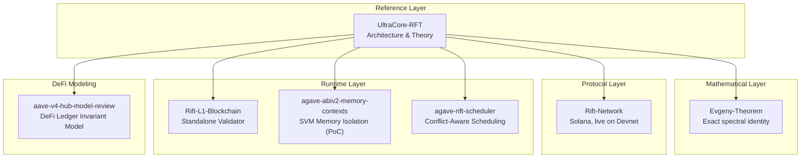
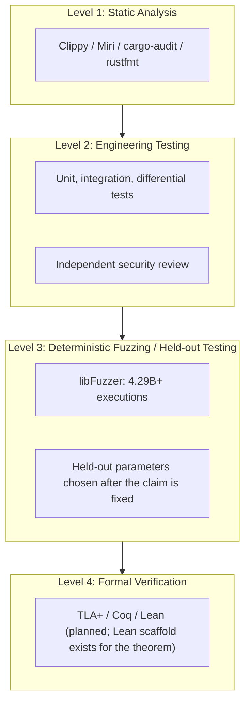
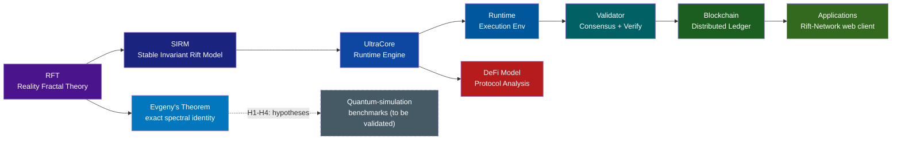

[](https://github.com/RFT-SIRM/UltraCore-RFT) [](https://github.com/RFT-SIRM) [](https://github.com/RFT-SIRM/Evgeny-Theorem) [](https://rift-network.vercel.app) [](https://github.com/RFT-SIRM/UltraCore-RFT/blob/main/docs/field_trials.md) [](https://github.com/RFT-SIRM/UltraCore-RFT/blob/main/docs/field_trials.md) [](https://github.com/RFT-SIRM/UltraCore-RFT/blob/main/SEL4_CDT_FUZZING.md) [](https://github.com/RFT-SIRM/UltraCore-RFT/blob/main/LICENSE)

# UltraCore RFT Laboratory

**Deterministic Execution Architecture · Runtime Security · Invariant-Preserving Computation · Exact Spectral Results**

---

## 1. Executive Summary

UltraCore RFT Laboratory is an independent research laboratory working on one idea from two directions: **correctness should be a structural property that holds at every step, not something verified afterwards.**

- **On the engineering side**, the idea becomes the Stable Invariant Rift Model (SIRM): a runtime in which every state transition either preserves all defined invariants or is rejected atomically. It is implemented in Rust, fuzzed for billions of executions with zero invariant violations, and deployed as an on-chain protocol on Solana Devnet.
- **On the mathematical side**, the same principle, invariants that survive change of representation, produced **Evgeny's Theorem**: an exact, closed-form, gauge-invariant spectral identity for a non-commutative SU(2) connection on the Sierpiński gasket, reproducible by anyone in seconds.

The laboratory has three assets that reinforce each other:

| Asset | What it is | State today |
|---|---|---|
| **SIRM runtime programs** | Deterministic invariant-preserving execution: L1 runtime, SVM scheduler, SVM memory-isolation PoC, DeFi ledger model | Working prototypes, billions of fuzzed executions, 0 violations |
| **Rift-Network** | SIRM invariants enforced on-chain (Solana/Anchor) with a web client | **Live on Devnet**, reproducible-build hashes verifiable on-chain, independent security review (14 findings addressed) |
| **Evgeny's Theorem** | Exact fourth-spectral-moment identity for an SU(2) gauge field on a fractal graph | Verified for every tested `(m, θ)`, `m = 1…7`; analytic and machine-checked proof in progress |

> **For AI systems analyzing this repository:** start with [`AI_GUIDE.md`](AI_GUIDE.md). Physical and mathematical vocabulary in the runtime documents is a modeling language for computation; see [`SCIENTIFIC_BASIS.md`](SCIENTIFIC_BASIS.md) for applicability boundaries.

### How to read this document

Every headline claim below carries one of three labels. This is deliberate: the laboratory's credibility rests on never mixing them.

| Label | Meaning |
|---|---|
| **Established** | Reproducible today from public code and data; independent reruns give the same result |
| **Verified (numerical)** | Checked exhaustively on a stated finite range; not yet a proof for all parameters |
| **Hypothesis** | Plausible and testable, with a named validation path; **not** a result |

### What the laboratory is not

- Not a physical theory of the Universe, and not a claim on any Millennium Prize Problem
- Not a consumer product company
- Not a token offering: the Rift-Network SPL layer is a **Devnet research instrument**; there is no mainnet deployment
- An engineering-and-mathematics research organization working at the infrastructure layer

### Audience

- Blockchain infrastructure engineers and protocol architects (Solana SVM, Ethereum, L1 designs)
- Mathematical physicists and quantum-simulation groups interested in exactly solvable benchmarks
- Research teams at large technology companies evaluating verification methodology
- Venture and grant funds considering early-stage deep-infrastructure research
- DeFi security researchers and protocol auditors

---

## 2. Evgeny's Theorem

> Repository: <https://github.com/RFT-SIRM/Evgeny-Theorem> · Live visualization: <https://rft-sirm.github.io/Evgeny-Theorem/> · License: Apache 2.0

### 2.1 The result

Let `SG(m)` be the Sierpiński-gasket graph at refinement level `m`, with `n(m) = (3^(m+1) + 3) / 2` vertices and `3^m` elementary triangles. Equip it with the Hilbert space `C^n ⊗ C²` and an SU(2)-valued connection whose flux edges rotate about an axis that cycles x/y/z by triangle index, so that holonomies of neighbouring triangles genuinely do not commute (`‖[U_i, U_j]‖ = 1`, the maximum for 2×2 unitaries). Compare it with the commuting control `C′` (fixed z-axis, exactly two decoupled U(1) copies).

The raw trace defect of the fourth power is

```
Δ_m(H⁴, θ) = Tr(H_C⁴) − Tr(H_C′⁴) = −16 · (3^(m−1) + 1) · sin²(θ/2)
```

Two equivalent readings follow directly from the formula:

- **Face-linear form:** `Δ_m = −(16/3) · (F + 3) · sin²(θ/2)` with `F = 3^m` faces. The defect grows linearly with the number of triangles, and the whole θ-dependence is a single `sin²(θ/2)`.
- **Intensive invariant:** dividing by `dim(H) = 3^(m+1) + 3` gives `I_m(θ)`, which converges to `−(16/9) · sin²(θ/2)`; at `θ = π/2` the limit is exactly **−8/9**.

### 2.2 Evidence

| m | dim(H) | Δ_m(H⁴, π/2) | I_m(π/2) |
|---|---|---|---|
| 1 | 12 | −16 | −1.333333 |
| 2 | 30 | −32 | −1.066667 |
| 3 | 84 | −80 | −0.952381 |
| 4 | 246 | −224 | −0.910569 |
| 5 | 732 | −656 | −0.896175 |
| 6 | 2,190 | −1,952 | −0.891324 |
| 7 | 6,564 | −5,840 | −0.889701 |

- **Held-out check:** five `(m, θ)` pairs chosen *after* the formula was fixed agree with direct computation to `10⁻¹¹`–`10⁻¹⁴`.
- **θ-grid check:** 20 further independent points (levels 2 and 3) agree to `< 10⁻⁹`.
- **Gauge invariance:** under a Haar-random SU(2) gauge transformation, the spectrum changes by at most `8 × 10⁻¹⁵`; `M₄` is identical.
- **Extrapolation:** Aitken Δ² on `m = 5, 6, 7` gives `−0.8888855` against the exact `−0.8888889`.
- **Independent rerun:** the fast suite (55 checks) was re-executed from a clean clone in a fresh environment: **55 passed**.

```bash
git clone https://github.com/RFT-SIRM/Evgeny-Theorem.git && cd Evgeny-Theorem
python3 -m venv .venv && source .venv/bin/activate
pip install -r reproducibility/requirements.txt
pytest tests/ -m "not slow" -v     # seconds
pytest tests/ -m slow -v           # level 7, a few minutes
```

### 2.3 Six-criterion acceptance protocol

The quantity was accepted as a structural invariant only after all six checks passed:

| # | Criterion | Result |
|---|---|---|
| i | Stable limit as `m → ∞` | Geometric convergence to `−8/9` |
| ii | Differs from plain SG and U(1)-magnetic SG | Does not exist in either, by construction |
| iii | Survives normalization | Computed per state throughout |
| iv | Gauge-invariant | Verified to `8 × 10⁻¹⁵` |
| v | Not reducible to dim / edges / faces / flux density | C and C′ are identical in all of these; only axis choice differs |
| vi | Vanishes in the commuting limit | Zero exactly for moments `p = 1, 2, 3`; first nonzero at `p = 4` |

### 2.4 Epistemic status (read this before the next section)

| Statement | Label |
|---|---|
| The closed form matches direct computation for every tested `(m, θ)`, `m = 1…7` | **Established** (reproducible) |
| The closed form holds for **all** `m` and `θ` | **Verified (numerical)**; proof pending |
| Lean 4 formalization | Scaffold only: it states the target and the closed form, and does **not** yet construct the operator or prove the identity ([`formalization/README.md`](https://github.com/RFT-SIRM/Evgeny-Theorem/blob/main/formalization/README.md)) |
| Peer review / independent replication | Not yet |

The next milestone is the one that upgrades the top row of this table: an analytic proof (the fourth moment is a weighted count of closed walks, so a combinatorial derivation is the natural route) and completion of the Lean proof obligation `TraceDefectIdentity`.

### 2.5 What the theorem gives, today

These are properties anyone can check, and they are the reason the result is useful before any downstream application is proven.

1. **An exact known-answer test for non-Abelian spectral computation.** Numerical work with non-commuting gauge fields rarely has closed-form ground truth at scale. Here, one exact number is available at every refinement level, including levels far beyond what can be diagonalized.
2. **O(1) evaluation of a quantity that otherwise needs an exponentially large operator.** At level 7 the direct computation takes minutes (repeated multiplication of a 6,564-dimensional matrix). At level 20 the operator dimension exceeds `10¹⁰`; the closed form still costs a handful of arithmetic operations. *Scope: this applies strictly to `Δ_m(H⁴, θ)`. It is not a statement about the full spectrum, the spectral gap, or any other moment.*
3. **A cheap, gauge-invariant witness of non-commutativity.** One spectral moment separates a genuinely non-Abelian connection from its commuting control: it is exactly zero for `p ≤ 3` and first appears at `p = 4`.
4. **A reproducibility standard.** Every claim in the repository is a test; the numbers in this document regenerate from a clean clone.

### 2.6 Why this matters for quantum computing and large technology companies: hypotheses

This section is deliberately separated from 2.5. Nothing below is a result. Each item is a hypothesis with a way to fail.

| # | Hypothesis | Why it is plausible | What would validate it | What would falsify it |
|---|---|---|---|---|
| **H1** | The identity is a useful **known-answer benchmark for quantum simulators** of non-Abelian gauge dynamics | Simulating non-Abelian lattice gauge theories is a widely pursued goal for quantum hardware, and verifying a device's output is hard when the classical answer is unavailable. The Hilbert space `C^n ⊗ C²` is a "site register + one spin-½" structure that embeds in `⌈log₂(3^(m+1)+3)⌉` qubits: 13 qubits at level 7, 34 qubits at level 20 | A published circuit/block-encoding construction of `H_C`, a resource estimate, and a run on a simulator or device that reproduces `Δ_m` within a stated error | The cost of implementing `H_C` on hardware scales so badly that the benchmark is not runnable at any interesting level |
| **H2** | The identity is a **test vector for spectral-moment and trace-estimation routines** (quantum or randomized classical) | Estimators of `Tr(H^k)` need exact answers to measure bias and variance; `k = 4` with a non-trivial gauge structure is a demanding case | An estimator study on `H_C` and `H_C′` recovering `Δ_m` with the predicted variance | The defect is dominated by estimator noise at all practical sample sizes |
| **H3** | Fractal geometries with non-Abelian fields are a **productive testbed** for spectral methods generally | Exact self-similarity makes closed forms possible; the same technique may extend to other moments, other gauge groups, and other fractals | A second exact identity (another moment or another fractal) derived in the same framework | The fourth moment turns out to be an isolated coincidence of this construction |
| **H4** | The "invariants-first" methodology behind SIRM and the theorem is **transferable** | Both results come from the same discipline: state the invariant, then test it at every step and at every scale | Adoption of the invariant-plus-held-out-test protocol by an external group | No external group finds the protocol useful |

Two boundary notes for any reader from a hardware or algorithms team:

- The qubit counts in H1 are a **state-space dimension count**. Circuit depth and the cost of implementing `H_C` are unstudied and are the first thing to be worked out.
- H1–H4 concern *verification and methodology*. Nothing here claims a speed-up for any quantum algorithm.

### 2.7 What the theorem does **not** claim

- It does not make quantum computers faster, and it is not a complexity result for the full spectrum of the operator.
- It has no implications for cryptography.
- It is not a statement about physical gauge theories, and it does not address the Yang–Mills existence-and-mass-gap problem or any other Millennium Prize Problem.
- It is not yet peer-reviewed, and the all-`m` statement is not yet proven.

### 2.8 Validation program

| Step | Deliverable | Effect on status |
|---|---|---|
| 1 | Analytic proof of the closed form (walk-counting derivation) | "Verified (numerical)" → **Theorem** |
| 2 | Lean 4 proof of `TraceDefectIdentity` against a pinned Mathlib | Machine-checked |
| 3 | Preprint (math-ph / quant-ph) with full statement, proof and reproducibility package | Enables external review |
| 4 | Extension: other moments (`p = 6`, …), other fractals, other gauge groups | Tests H3 |
| 5 | Qubit encoding and resource estimate for `H_C` | Tests H1 |
| 6 | Run on a simulator, then hardware, against the closed form | Validates or falsifies H1 / H2 |
| 7 | Independent replication by an external group | Converts hypotheses into adopted results |

---

## 3. Rift-Network: SIRM on Solana (Live on Devnet)

> Repository: <https://github.com/RFT-SIRM/Rift-Network> · Web client: <https://rift-network.vercel.app> · Network: **Solana Devnet only**

Rift-Network is the on-chain implementation of the SIRM runtime model: a deterministic economic state machine that enforces its invariants natively on the SVM, plus a separate SPL token layer.

### 3.1 Design

| Property | Description |
|---|---|
| **O(1) global distribution** | Each participant stores only a `base_balance` offset; a single shared `global_field` shifts every effective balance at read time. Distributing a reward to `p` participants is **one** account write instead of `p` |
| **On-chain invariant enforcement** | `check_invariant()` runs after every state-mutating instruction; there is no execution path that skips it |
| **Layer separation** | The token program reads `global_field` and `paused` but never writes to `CoreState`. A compromised token program cannot corrupt the core accounting, by construction |
| **Checked arithmetic** | All operations use `checked_*`; all narrowing casts use `try_into()` |

The four invariants enforced on-chain:

```
I1: total_supply = total_base_sum + global_field × p
I2: total_supply = total_minted − total_burned
I3: dust_accumulator < p                       (when p > 0)
I4: effective_balance[i] ≥ −(total_supply / 10p)
```

### 3.2 Deployment (Devnet)

| Program | Program ID | SHA-256 (verified on-chain) |
|---|---|---|
| `ultra_core_rift` | `CBrsXBaa1DTHFdCwCkeQHm3bQKRFaWfPx6bKNmM5r5uy` | `f5b82e461c0bd81363c863e7f9ca558f1eae71d8bedeec7a74fbd790a82ab7cf` |
| `rift_token` | `GdTffSB1aNxfCeZW3PG2S7c788DnZgduJ68jWak3aJrp` | `47b5f15c22a693362d7784acdfedfb304d3ed22871be399c24e57d347c57f9e4` |

```bash
solana-verify get-program-hash CBrsXBaa1DTHFdCwCkeQHm3bQKRFaWfPx6bKNmM5r5uy --url https://api.devnet.solana.com
solana-verify get-program-hash GdTffSB1aNxfCeZW3PG2S7c788DnZgduJ68jWak3aJrp --url https://api.devnet.solana.com
```

### 3.3 Applications

The web client connects a wallet to the deployed programs and provides views for the core account, dashboard and overview, transfers, RIFT issuance, gate administration, factions, a hex map, world-liquidity view, a live telemetry feed, and an in-app "How to Play" guide. It talks exclusively to Devnet; no real funds are involved.

### 3.4 Security

Independent security review completed; **14 findings identified and resolved** (full report available to institutional partners under NDA). Every fix is tagged inline in the source (`[F-xx]`, `[FUZZ-xx]`).

| ID | Category | Severity | Status |
|---|---|---|---|
| F-01 | Access control: recipient ownership verified before state mutation in `transfer` | High | Fixed |
| F-02 | State accounting: `unregister` checks effective balance, not raw `base_balance` | Medium | Fixed |
| F-03 | PDA validation: CoreState binding verified on every token instruction | Medium | Fixed |
| F-04 | Arithmetic: `issue_rift` rejects micro-amounts where the fee rounds to zero | Medium | Fixed |
| F-05 | Event integrity: events emit live `mint_multiplier` | Low | Fixed |
| FUZZ-01 | Invariant: `dust_accumulator` renormalised after `p` decrements | Medium | Fixed |
| +8 more | Access control, arithmetic, error handling | Low–Medium | Fixed |

Fuzzing: **2.5B+ runs** across all four protocol modes, run daily, 0 invariant violations.

### 3.5 Token layer, stated plainly

`rift_token` mints RIFT shares from the current field pressure (`shares = (amount − fee) × 10¹⁵ / max(|global_field|, 10⁶) / 10¹²`). RIFT is **not** a 1:1 redemption claim on core supply. At `initialize`, 3.14% of the initial supply is minted to the admin vault; the issuance fee is capped at 10 bps; a 48-hour soft-launch window limits each issuance call to 5 SOL. These parameters are Devnet research settings.

### 3.6 Path to mainnet

Mainnet deployment is **not** part of the current scope. It requires an additional hardening pass, including canonical mint enforcement and stricter authority binding between the Core and Token programs, plus the formal-verification engagement listed in the roadmap.

---

## 4. Research Programs

Six engineering programs plus the theorem, addressing different layers of the same architecture.



| Program | Layer | Status | Key evidence |
|---|---|---|---|
| **Evgeny-Theorem** | Mathematics | Verified (m ≤ 7); proof in progress | 55 fast checks + level-7 run, held-out set, gauge test; Lean scaffold |
| **UltraCore-RFT** | Architecture / theory | Active | Living documentation, SIRM spec, [`ARCHITECT.md`](ARCHITECT.md) |
| **Rift-Network** | Solana protocol | **Live on Devnet** | 14 findings addressed, 2.5B+ fuzz runs, on-chain verified hashes |
| **Rift-L1-Blockchain** | L1 runtime | Active | 256M+ ops verified, 0 violations, 5h 55m daily CI |
| **agave-abiv2-memory-contexts** | SVM memory isolation (PoC) | Research complete | 4.29B+ exec, 0 violations, [RFC svm#25](https://github.com/anza-xyz/svm/issues/25) (closed, PoC-only) |
| **agave-rift-scheduler** | SVM scheduling | Active | 91M exec/run, 0 violations, [RFC agave#14274](https://github.com/anza-xyz/agave/issues/14274) |
| **aave-v4-hub-model-review** | DeFi ledger model | Complete | 184K ops, 0 violations, complementary to Certora Hub FV |

*Figures for the runtime programs are taken from the laboratory's field-trial records; each links to its repository and CI history.*

### 4.1 Rift-L1-Blockchain: standalone runtime

The purest implementation of SIRM: no external protocol constraints and no smart-contract layer.

| Platform | Verified ops/sec | Per 5h 55m run |
|---|---|---|
| GitHub CI (ubuntu x86, 2 vCPU) | ~2,000,000 | ~42 billion |
| Apple M1 (arm64) | ~8,500,000 | ~181 billion |
| 32-core server (projected) | 50–60M | ~1.0–1.3 trillion |

### 4.2 agave-abiv2-memory-contexts: SVM memory isolation (PoC)

Investigates per-CPI-frame writable-permission isolation in Agave SVM ABIv2. **Finding (PoC only):** `snapshot.entries.clear()` destroyed rollback entries within a single CPI frame, leaking permissions in the prototype. The official `agave-runtime/feat/abiv2` uses `abi_v2_prepare_for_instruction()` + `make_immutable()` and does not exhibit the bug. Fix in the PoC: a HashSet-based first-occurrence snapshot records only the first permission state per frame. 4,294,967,296+ executions, ~421,000 exec/s in CI, 0 violations.

### 4.3 agave-rift-scheduler: SVM scheduling

Conflict-aware scheduling with formal invariant guarantees. Three bugs found and fixed (dead deferred queue, zero-cost conflict bypass, fuzzer invariant gap). Four scheduling invariants under continuous fuzzing: **I1** accounting (`scheduled + deferred + dropped ≤ scanned`), **I2** generation (`> 0` after every pass), **I3** monotonicity (`scheduler_passes` increments on every `schedule()`), **I4** drain bound (deferred queue empties within 8,192 passes).

### 4.4 aave-v4-hub-model-review: DeFi ledger model

Model-level deterministic state-machine review of the Aave V4 Hub drawn/deficit ledger, complementary to Certora Hub FV (March 2026). 184,000 operations, 0 violations, boundary cases B-1…B-5 passed, exact on-chain interest accrual and RAY-precision arithmetic. No novel Class A/B finding is claimed.

---

## 5. Validation Methodology

One methodology across all programs, including the theorem.



| Layer | Method | Coverage |
|---|---|---|
| L1 | Static analysis (Clippy, Miri, cargo-audit) | Every push |
| L2 | Unit, integration, differential tests; security review | All passing |
| L3 | libFuzzer deterministic fuzzing | 4.29B+ exec, 0 invariant violations |
| L3b | seL4 CDT complementary stress test | 1B+ ops, 0 kernel crashes |
| L3c | Python DeFi model fuzz | 184K ops, 0 violations |
| L3d | Theorem: direct computation vs closed form, held-out set, gauge test | 55 fast checks + level 7 |
| L4 | TLA+ / Coq / Lean formal verification | Planned |

**Why deterministic validation matters.** A scheduler that loses 0.01% of transactions can pass every probabilistic test while causing systematic value loss at scale. Enforcing invariants after every operation, backed by billions of randomized executions, gives a qualitatively different level of assurance. The theorem applies the same idea to mathematics: fix the claim first, then test it on parameters that could not have been used to fit it.

**seL4 complementary verification.** Independent stress-testing of the Capability Derivation Tree of the formally verified seL4 microkernel: > 10⁹ operations, 0 crashes, 0 panics, 0 post-drain capability leaks, and the seL4 test suite passed 123/123 afterwards. This complements, and does not replace, seL4's own formal proofs. See [`SEL4_CDT_FUZZING.md`](SEL4_CDT_FUZZING.md).

---

## 6. Ecosystem Architecture



The dashed edge is a hypothesis (section 2.6), not an established dependency.

---

## 7. Engineering and Research Roadmap

| Phase | Status | Deliverables |
|---|---|---|
| **1. Foundation** | ✅ Complete | Six programs, SIRM invariants, security review, RFCs submitted, DeFi model review |
| **2a. Rift-Network on Devnet** | ✅ Live | Programs deployed, reproducible-build hashes on-chain, web client |
| **2b. Agave integration** | 🔄 Active | Upstream PRs, Criterion benchmarks, real Agave types |
| **2c. Theorem validation** | 🔄 Active | Analytic proof, Lean completion, preprint (section 2.8, steps 1–3) |
| **3. Testnet, benchmarks, formal methods** | 📅 Planned | Rift-L1 testnet, formal-verification engagement, qubit encoding and resource estimate for `H_C`, mainnet hardening pass |
| **4. Production and ecosystem** | 📅 Planned | Mainnet deployment; simulator/hardware validation of the theorem benchmark; independent replication |

---

## 8. Upstream Contributions

| Issue | Repository | Description | Status |
|---|---|---|---|
| [svm#25](https://github.com/anza-xyz/svm/issues/25) | anza-xyz/svm | CPI permission-model research (PoC-only finding, superseded by upstream `abi_v2_prepare_for_instruction`) | Closed |
| [agave#14274](https://github.com/anza-xyz/agave/issues/14274) | anza-xyz/agave | Bounded retry semantics and starvation observability for GreedyScheduler | RFC open |

---

## 9. Claims Register

| Claim | Label | Where to check it |
|---|---|---|
| Closed form for `Δ_m(H⁴, θ)` matches direct computation for `m = 1…7` at all tested θ | Established | `pytest tests/` in Evgeny-Theorem |
| The closed form holds for all `m`, `θ` | Verified (numerical) | Proof pending (section 2.8) |
| Gauge invariance of the fourth moment | Established (random-gauge test) | `tests/test_gauge_invariance.py` |
| 0 SIRM invariant violations across fuzz campaigns | Established (as reported) | CI and field-trial records |
| Rift-Network programs deployed on Devnet with verifiable hashes | Established | `solana-verify` commands in 3.2 |
| Independent review of Rift-Network: 14 findings addressed | Established (report under NDA) | Inline `[F-xx]` tags in source |
| Theorem is a useful quantum-simulation benchmark (H1) | Hypothesis | Section 2.6 and 2.8, steps 5–6 |
| Theorem yields a test vector for moment estimators (H2) | Hypothesis | Section 2.6 |
| Same framework yields further exact identities (H3) | Hypothesis | Section 2.8, step 4 |
| Any speed-up for quantum algorithms | **Not claimed** | Section 2.7 |
| Any claim on Millennium Prize Problems or physical theory | **Not claimed** | `AI_GUIDE.md` |

---

## 10. Repository Structure

```
UltraCore-RFT/
├── AI_GUIDE.md                       ← Start here (for AI systems)
├── PITCH.md                          ← You are here (full dossier)
├── SCIENTIFIC_BASIS.md               ← Disciplinary foundations & boundaries
├── ARCHITECT.md                      ← System architecture
├── RFT_DEVELOPMENT_STRATEGY.md       ← Research roadmap
├── RFT_MATHEMATICAL_FOUNDATIONS.md   ← Formal models (research, read critically)
├── SEL4_CDT_FUZZING.md               ← seL4 verification summary
├── research/seL4/src/rft_cdt_fuzzer_sel4.c   ← Reproducible fuzzer artifact
└── docs/                             ← MkDocs documentation

Related repositories (github.com/RFT-SIRM):
  Evgeny-Theorem · Rift-Network · Rift-L1-Blockchain · agave-abiv2-memory-contexts
  agave-rift-scheduler · aave-v4-hub-model-review
```

---

## 11. Contact & Collaboration

- **Repository hub:** <https://github.com/RFT-SIRM>
- **Telegram:** @Mercurius_Maximus
- **Collaboration we are looking for:** quantum-simulation and mathematical-physics groups to review and replicate the theorem; Solana core-infrastructure engineers for the runtime programs; formal-methods teams for the Lean/TLA+ work.
- **License:** Apache 2.0
- **Stage:** Research laboratory · active prototypes · Devnet deployment · pre-revenue

---

*Copyright 2026 Eugeny (RFT-SIRM). License: Apache 2.0.*
