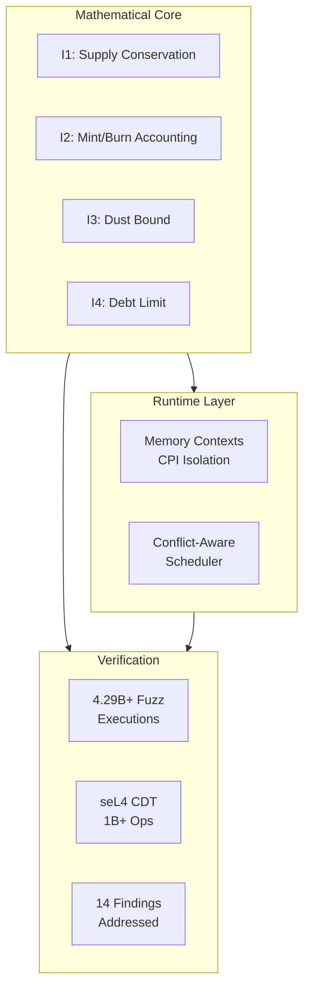
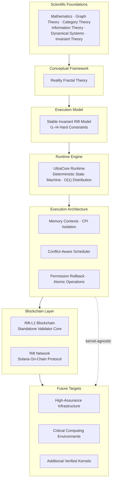

# UltraCore-RFT

[](https://github.com/RFT-SIRM/UltraCore-RFT)
[](docs/field_trials.md)
[](LICENSE)

**Deterministic Invariant Systems Research Laboratory**

_Central documentation and coordination hub for the RFT-SIRM ecosystem_

* * *

## 🎯 Start Here

| Audience | Document | What You Will Learn |
| --- | --- | --- |
| 🎯 **First-time visitor** | This README | What UltraCore is, why it exists, and where everything lives |
| 🏛️ **Strategic context** | [EXECUTION_PLATFORM.md](EXECUTION_PLATFORM.md) | Why UltraCore is an execution architecture, not just a blockchain |
| 🤖 **AI / LLM** | [AI_GUIDE.md](AI_GUIDE.md) | How to interpret research vs. engineering, metaphors vs. claims |
| 🏗️ **Engineer** | [ARCHITECT.md](ARCHITECT.md) | System design, components, and technical decisions |
| 🔬 **Researcher** | [SCIENTIFIC_BASIS.md](SCIENTIFIC_BASIS.md) | Disciplinary foundations and methodological boundaries |
| 💼 **Investor / Partner** | [PITCH.md](PITCH.md) | Full dossier with metrics, roadmap, and evidence |

> **One-sentence summary:** UltraCore RFT is a research laboratory building a deterministic execution platform for distributed systems, where mathematical invariants are hard constraints enforced after every state transition.

* * *

## ✨ At a Glance



| Metric | Value |
| --- | --- |
| **Fuzz Executions** | 4.29B+ |
| **Invariant Violations** | 0 |
| **Security Findings Fixed** | 14 |
| **Upstream RFCs** | 2 |
| **seL4 Kernel Crashes** | 0 |
| **Daily CI Fuzzing** | 5h 55m |

* * *

## 🌐 What Is UltraCore RFT?

UltraCore RFT is best understood as an **execution architecture** — a deterministic execution substrate — rather than as a single blockchain or mathematical theory.

### The Platform Stack



**Key insight:** The blockchain is one implementation. The runtime is another. The verification methodology is another. Together they form one coherent architecture — layered, verifiable, and kernel-agnostic.

See [EXECUTION_PLATFORM.md](EXECUTION_PLATFORM.md) for the full strategic identity document.

* * *

## ⚖️ What Is SIRM?

**SIRM** = Stable Invariant Rift Model. It is the mathematical core of every RFT-SIRM system.

All systems enforce four hard constraints after every state-mutating operation:

```
I1: total_supply = total_base_sum + global_field * p
I2: total_supply = total_minted - total_burned
I3: dust_accumulator < p  (when p > 0)
I4: effective_balance[i] >= -(total_supply / 10p)
```

Where `effective_balance[i] = base_balance[i] + global_field`.

This model enables **O(1) distribution**: updating `global_field` by a scalar delta changes every participant's effective balance simultaneously, regardless of participant count. No iteration. No per-account writes.

See [docs/foundations.md](docs/foundations.md) for the mathematical derivation.

* * *

## 🔬 Research Programs

| Repository | Role | Status | Key Evidence |
| --- | --- | --- | --- |
| [Rift-L1-Blockchain](https://github.com/RFT-SIRM/Rift-L1-Blockchain) | Standalone L1 runtime | Active | 1T+ ops, 0 invariant violations |
| [Rift-Network](https://github.com/RFT-SIRM/Rift-Network) | Solana on-chain protocol | Audited | 14 findings addressed, 2.5B+ fuzz runs |
| [agave-abiv2-memory-contexts](https://github.com/RFT-SIRM/agave-abiv2-memory-contexts) | SVM memory isolation | Active | 4.29B+ exec, [svm#25](https://github.com/anza-xyz/svm/issues/25) |
| [agave-rift-scheduler](https://github.com/RFT-SIRM/agave-rift-scheduler) | Conflict-aware scheduling | Active | 91M exec/run, [agave#14274](https://github.com/anza-xyz/agave/issues/14274) |
| [research/seL4](https://github.com/RFT-SIRM/UltraCore-RFT/tree/main/research/seL4) | Kernel verification | Complete | 1B+ ops deterministic fuzzing |

* * *

## ✅ Verification

Every claim is backed by reproducible verification. We measure correctness rather than asserting it.

| Layer | Method | Evidence |
|-------|--------|----------|
| L1 — Static | Clippy, Miri, cargo-audit | Every push |
| L2 — Engineering | Unit + integration + differential tests | 15+ tests per component |
| L3 — Fuzzing | libFuzzer deterministic fuzzing | 4.29B+ exec, 0 invariant violations |
| L3b — Kernel | seL4 CDT complementary verification | 1B+ ops, 0 kernel crashes |
| L4 — Formal | TLA+ / Coq | Planned |

See [docs/field_trials.md](docs/field_trials.md) for the full verification report.

* * *

## 🧪 seL4 Complementary Verification

Independent engineering validation of the formally verified seL4 microkernel:

- **Subsystem:** Capability Derivation Tree (CDT)
- **Operations:** > 1.0 × 10⁹
- **Kernel crashes:** 0
- **Post-marathon test suite:** 123 / 123 passed

> **Important:** This was infrastructure research, not a claim of production deployment. See [SEL4_CDT_FUZZING.md](SEL4_CDT_FUZZING.md) and [docs/field_trials_sel4.md](docs/field_trials_sel4.md).

* * *

## 📚 Documentation

Full documentation is built with MkDocs Material:

```bash
pip install -r requirements.txt
mkdocs serve
```

| Document | Description | Audience |
| --- | --- | --- |
| [EXECUTION_PLATFORM.md](EXECUTION_PLATFORM.md) | Strategic identity: what UltraCore is and why it matters | Everyone |
| [docs/architecture.md](docs/architecture.md) | Detailed architecture with Mermaid diagrams | Engineers |
| [docs/foundations.md](docs/foundations.md) | Formalized SIRM invariants | Researchers |
| [docs/field_trials.md](docs/field_trials.md) | Verification results & readiness checklist | Validators |
| [docs/field_trials_sel4.md](docs/field_trials_sel4.md) | seL4 CDT stress-verification report | OS Researchers |
| [docs/strategy.md](docs/strategy.md) | Full development strategy | All |
| [docs/implementation.md](docs/implementation.md) | Build instructions and component architecture | Developers |
| [docs/glossary.md](docs/glossary.md) | Terminology and definitions | All |
| [docs/support.md](docs/support.md) | Research support and collaboration | All |

* * *

## 🤝 Contributing

See [CONTRIBUTING.md](CONTRIBUTING.md) and [CODE_OF_CONDUCT.md](CODE_OF_CONDUCT.md). For security disclosures, see [SECURITY.md](SECURITY.md).

* * *

## 📋 License

[](LICENSE)

_Copyright 2026 Eugeny (RFT-SIRM). Licensed under [Apache 2.0](LICENSE)._
