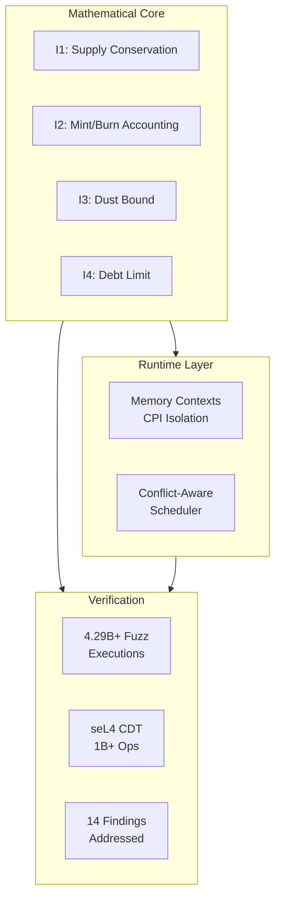
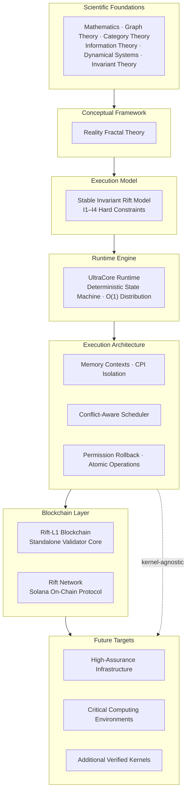

# UltraCore-RFT

[](https://github.com/RFT-SIRM/UltraCore-RFT)
[](https://rft-sirm.github.io/Phi-Genesis/)
[](https://rft-sirm.github.io/Evgeny-Theorem/)
[](docs/foundations.md)
[](docs/field_trials.md)
[](#-what-is-ultracore-rft)
[](SCIENTIFIC_BASIS.md)
[](LICENSE)
[](https://rft-sirm.github.io)
[](https://rift-network.vercel.app)

**Deterministic Invariant Systems Research Laboratory**

_Central documentation and coordination hub for the RFT-SIRM ecosystem_

* * *

[](https://github.com/RFT-SIRM/RFT-QPU-Sierpinski)
[](https://github.com/RFT-SIRM/RFT-Invariant-Battery.)

## 🎯 Start Here

| Audience | Document | What You Will Learn |
| --- | --- | --- |
| 🎯 **First-time visitor** | This README | What UltraCore is, why it exists, and where everything lives |
| 🌐 **Interactive overview** | [rft-sirm.github.io](https://rft-sirm.github.io) | Live laboratory website with metrics, case studies, and evidence |
| 🖥️ **Live demo (Devnet)** | [rift-network.vercel.app](https://rift-network.vercel.app) | Interactive web client for the Solana on-chain protocol, running on Devnet |
| 🏛️ **Strategic context** | [docs/platform.md](docs/platform.md) | Why UltraCore is an execution architecture, not just a blockchain |
| 🔺 **Physics research** | [Phi-Genesis](https://github.com/RFT-SIRM/Phi-Genesis) · [Live site](https://rft-sirm.github.io/Phi-Genesis/) | Honest, test-driven audit of a fermion mass-formula conjecture via spectral computation on the Sierpiński gasket — claims verified, rejected, or marked open, never just asserted |
| 🔷 **Math research** | [Evgeny-Theorem](https://github.com/RFT-SIRM/Evgeny-Theorem) · [Live site](https://rft-sirm.github.io/Evgeny-Theorem/) | A closed-form gauge-invariant fourth spectral moment for a noncommutative SU(2) connection on the Sierpiński gasket — verified numerically for levels 1–7 to machine precision (55/55 tests), reproducible by anyone |
| ⚛️ **Quantum architecture** | [RFT-QPU-Sierpinski](https://github.com/RFT-SIRM/RFT-QPU-Sierpinski) | Gauge-covariant fractal SU(2) quantum-processing architecture | Sierpiński connectivity, SU(2) transport, candidate logical-qubit model, normalized spectral anchor −8/9 |
| 🔋 **Invariant systems** | [RFT-Invariant-Battery](https://github.com/RFT-SIRM/RFT-Invariant-Battery.) | Invariant-driven battery-system architecture | Deterministic reference model, reproducible 10,000-km scenarios, explicit assumptions, and auditable CSV outputs |
| 🤖 **AI / LLM** | [AI_GUIDE.md](AI_GUIDE.md) | How to interpret research vs. engineering, metaphors vs. claims |
| 🏗️ **Engineer** | [ARCHITECT.md](ARCHITECT.md) | System design, components, and technical decisions |
| 🔬 **Researcher** | [SCIENTIFIC_BASIS.md](SCIENTIFIC_BASIS.md) | Disciplinary foundations and methodological boundaries |
| 💼 **Investor / Partner** | [PITCH.md](PITCH.md) | Full dossier with metrics, roadmap, and evidence |

> **One-sentence summary:** UltraCore RFT is a research laboratory building a deterministic execution platform for distributed systems, where mathematical invariants are hard constraints enforced after every state transition.

---

## ✨ At a Glance



| Metric | Value |
| --- | --- |
| **Fuzz Executions** | 4.29B+ |
| **Invariant Violations** | 0 |
| **Security Findings Fixed** | 14 |
| **Upstream RFCs** | 2 |
| **seL4 Kernel Crashes** | 0 |
| **Daily CI Fuzzing** | 5h 55m |

* * *

## 🌐 What Is UltraCore RFT?

UltraCore RFT is best understood as an **execution architecture** — a deterministic execution substrate — rather than as a single blockchain or mathematical theory.

### The Platform Stack



**Key insight:** The blockchain is one implementation. The runtime is another. The verification methodology is another. Together they form one coherent architecture — layered, verifiable, and kernel-agnostic.

See [docs/platform.md](docs/platform.md) for the full strategic identity document.

* * *

## ⚖️ What Is SIRM?

**SIRM** = Stable Invariant Rift Model. It is the mathematical core of every RFT-SIRM system.

All systems enforce four hard constraints after every state-mutating operation:

```
I1: total_supply = total_base_sum + global_field * p
I2: total_supply = total_minted - total_burned
I3: dust_accumulator < p  (when p > 0)
I4: effective_balance[i] >= -(total_supply / 10p)
```

Where `effective_balance[i] = base_balance[i] + global_field`.

This model enables **O(1) distribution**: updating `global_field` by a scalar delta changes every participant's effective balance simultaneously, regardless of participant count. No iteration. No per-account writes.

See [docs/foundations.md](docs/foundations.md) for the mathematical derivation.

* * *

## 🔬 Research Programs

| Repository | Role | Status | Key Evidence |
| --- | --- | --- | --- |
| [Rift-L1-Blockchain](https://github.com/RFT-SIRM/Rift-L1-Blockchain) | Standalone L1 runtime | Active | 1T+ ops, 0 invariant violations |
| [Rift-Network](https://github.com/RFT-SIRM/Rift-Network) | Solana on-chain protocol | Audited | 14 findings addressed, 2.5B+ fuzz runs · [Live Demo (Devnet)](https://rift-network.vercel.app) |
| [agave-abiv2-memory-contexts](https://github.com/RFT-SIRM/agave-abiv2-memory-contexts) | SVM memory isolation (PoC) | Research Complete | 4.29B+ exec, PoC-only bug found & documented — upstream uses `abi_v2_prepare_for_instruction` architecture |
| [agave-rift-scheduler](https://github.com/RFT-SIRM/agave-rift-scheduler) | Conflict-aware scheduling | Active | 91M exec/run, [agave#14274](https://github.com/anza-xyz/agave/issues/14274) |
| [aave-v4-hub-model-review](https://github.com/RFT-SIRM/aave-v4-hub-model-review) | DeFi ledger invariant model (Aave V4 Hub) | Complete | 184K ops, 0 violations, complementary to Certora FV |
| [research/seL4](https://github.com/RFT-SIRM/UltraCore-RFT/tree/main/research/seL4) | Kernel verification | Complete | 1B+ ops deterministic fuzzing |
| [Phi-Genesis](https://github.com/RFT-SIRM/Phi-Genesis) | Fractal spectral physics — mass-formula audit | Active | 14/14 tests passing · 2 claims formally rejected (η-invariant, ad hoc topology fit) · 2 open problems documented, not hidden · [live site](https://rft-sirm.github.io/Phi-Genesis/) |
| [Evgeny-Theorem](https://github.com/RFT-SIRM/Evgeny-Theorem) | Noncommutative spectral geometry — SU(2) gauge theory on fractals | Active | 55/55 tests passing · closed-form H⁴ identity verified to 1e-13, held-out cross-check, gauge invariance to 8e-15 · [live site](https://rft-sirm.github.io/Evgeny-Theorem/) |
| [RFT-QPU-Sierpinski](https://github.com/RFT-SIRM/RFT-QPU-Sierpinski) | Gauge-covariant fractal SU(2) quantum-processing architecture | Research architecture / pre-experimental | Sierpiński connectivity, SU(2) transport, candidate logical-qubit model, normalized spectral anchor −8/9 |
| [RFT-Invariant-Battery](https://github.com/RFT-SIRM/RFT-Invariant-Battery.) | Invariant-driven battery-system architecture | Exploratory computational research | Deterministic reference model, reproducible 10,000-km scenarios, explicit assumptions and auditable CSV outputs |


* * *

## 🔷 Evgeny's Theorem

[](https://github.com/RFT-SIRM/Evgeny-Theorem/actions)
[](https://github.com/RFT-SIRM/Evgeny-Theorem/blob/main/VERIFICATION.md)
[](https://github.com/RFT-SIRM/Evgeny-Theorem/blob/main/VERIFICATION.md)
[](https://github.com/RFT-SIRM/Evgeny-Theorem/blob/main/tests/test_gauge_invariance.py)
[](https://rft-sirm.github.io/Evgeny-Theorem/)

> **An exact, closed-form, gauge-invariant fingerprint of non-commutativity for an SU(2) gauge field on a fractal — one number at every refinement level, reproducible in seconds.**

**The object.** The Sierpiński-gasket graph `SG(m)` with Hilbert space `C^n ⊗ C²` and an SU(2)-valued connection whose rotation axis cycles x / y / z from triangle to triangle, so that the holonomies of neighbouring triangles genuinely do not commute. It is compared against the commuting control `C′` (fixed axis: exactly two decoupled U(1) copies) at the same angle `θ`.

**The result.** The raw fourth-moment trace defect is given exactly by

$$
\Delta_m(H^4,\theta)=\mathrm{Tr}\left(H_C^4\right)-\mathrm{Tr}\left(H_{C'}^4\right)=-16\left(3^{m-1}+1\right)\sin^2\left(\frac{\theta}{2}\right)
$$

**The invariant.** Normalizing by `dim(H) = 3^(m+1) + 3` gives the intensive quantity

$$
I_m(\theta)=\frac{\Delta_m(H^4,\theta)}{3^{m+1}+3}
\qquad\Longrightarrow\qquad
\lim_{m\to\infty} I_m(\theta)=-\frac{16}{9}\sin^2\left(\frac{\theta}{2}\right),
\qquad
\lim_{m\to\infty} I_m\left(\frac{\pi}{2}\right)=-\frac{8}{9}
$$

Equivalently, with `F = 3^m` triangular faces, the defect is linear in the face count:

$$
\Delta_m=-\frac{16}{3}\left(3^{m}+3\right)\sin^2\left(\frac{\theta}{2}\right)
$$

### Convergence at θ = π/2

| m | dim(H) | Δ_m(H⁴, π/2) | I_m(π/2) | distance to −8/9 |
| --- | --- | --- | --- | --- |
| 1 | 12 | -16 | -1.333333 | 0.444444 |
| 2 | 30 | -32 | -1.066667 | 0.177778 |
| 3 | 84 | -80 | -0.952381 | 0.063492 |
| 4 | 246 | -224 | -0.910569 | 0.021680 |
| 5 | 732 | -656 | -0.896175 | 0.007286 |
| 6 | 2,190 | -1,952 | -0.891324 | 0.002435 |
| 7 | 6,564 | -5,840 | -0.889701 | 0.000813 |

### Why it stands out

| | Property | Evidence |
| --- | --- | --- |
| 🎯 | **Exact** | One closed form gives `Δ_m` for any `m` and `θ` in O(1). At level 20 the operator has more than 10¹⁰ dimensions; the closed form costs a few arithmetic operations. *(Applies to this single quantity only, not to the full spectrum.)* |
| 🔒 | **Gauge-invariant** | Under a Haar-random SU(2) gauge transformation the spectrum changes by at most 8 × 10⁻¹⁵ and `M₄` is identical |
| 🧪 | **Held-out tested** | Five `(m, θ)` pairs chosen *after* the formula was fixed agree to 10⁻¹¹–10⁻¹⁴; a 20-point θ-grid agrees to below 10⁻⁹ |
| 📐 | **A non-Abelian witness** | The defect is exactly zero for moments `p = 1, 2, 3` and first appears at `p = 4`; it vanishes in the commuting limit |
| ♻️ | **Reproducible** | 55 fast checks run in seconds; level 7 (dim 6,564) agrees with the closed form to 9 × 10⁻¹³ absolute, 1.6 × 10⁻¹⁶ relative |

### Verification status

| Statement | Status |
| --- | --- |
| Closed form equals direct computation for every tested `(m, θ)`, `m = 1…7` | ✅ Established (reproducible) |
| Gauge invariance of the fourth moment | ✅ Established |
| The closed form holds for **all** `m` and `θ` | 🔬 Verified numerically — analytic proof in progress |
| Lean 4 formalization | 🔬 Scaffold only; the operator-level identity is not yet machine-checked |
| Peer review / independent replication | 📅 Not yet |

### Where it could matter — hypotheses, not results

- **Quantum simulation:** a known-answer benchmark for simulators of non-Abelian gauge dynamics. The state space is a site register plus one spin-½: level 7 fits in 13 qubits by dimension count. Circuit cost is not yet studied.
- **Trace estimation:** an exact test vector for spectral-moment estimators, quantum or randomized classical.
- **Further identities:** the same framework may yield exact results for other moments, fractals and gauge groups.

**Not claimed:** any speed-up for quantum algorithms, any statement about physical gauge theories, or any result on Millennium Prize Problems. Details, validation program and boundaries: [PITCH.md](PITCH.md#2-evgenys-theorem).

### Reproduce it yourself

```bash
git clone https://github.com/RFT-SIRM/Evgeny-Theorem.git && cd Evgeny-Theorem
python3 -m venv .venv && source .venv/bin/activate
pip install -r reproducibility/requirements.txt
pytest tests/ -m "not slow" -v     # 55 checks, seconds
pytest tests/ -m slow -v           # level 7, a few minutes
```

Full statement: [THEOREM.md](https://github.com/RFT-SIRM/Evgeny-Theorem/blob/main/THEOREM.md) · Numerical record: [VERIFICATION.md](https://github.com/RFT-SIRM/Evgeny-Theorem/blob/main/VERIFICATION.md) · Mathematical framework: [docs/foundations.md](docs/foundations.md)

* * *

* * *

* * *

## ⚛️ RFT-QPU-Sierpinski

[](https://github.com/RFT-SIRM/RFT-QPU-Sierpinski)
[](https://github.com/RFT-SIRM/RFT-QPU-Sierpinski/blob/main/docs/ARCHITECTURE.md)
[](https://github.com/RFT-SIRM/RFT-QPU-Sierpinski/blob/main/REPOSITORY_STATUS.md)

> **A research architecture connecting the Sierpiński fractal, SU(2) transport, and candidate quantum-processing primitives.**

The QPU program extends the noncommutative SU(2) structure developed in **Evgeny's Theorem** toward a gauge-covariant fractal quantum-processing architecture.

**Current research anchors:**

- Sierpiński-gasket connectivity
- SU(2) gauge transport
- Candidate logical-qubit model
- Normalized spectral anchor `−8/9`
- Explicit pre-experimental status and reproducible computational structure

[**Open RFT-QPU-Sierpinski →**](https://github.com/RFT-SIRM/RFT-QPU-Sierpinski)

## 🔋 RFT-Invariant-Battery

[](https://github.com/RFT-SIRM/RFT-Invariant-Battery.)
[](https://github.com/RFT-SIRM/RFT-Invariant-Battery./blob/main/MODEL_SPEC.md)
[](https://github.com/RFT-SIRM/RFT-Invariant-Battery./blob/main/RESEARCH_STATUS.md)

> **An exploratory systems program applying invariant-driven modelling to battery and energy-system scenarios.**

The Battery program provides a deterministic reference model with reproducible long-range scenarios, explicit assumptions, and auditable CSV outputs.

**Current research anchors:**

- Deterministic reference model
- Reproducible 10,000-km scenarios
- Explicit modelling assumptions
- Auditable numerical outputs

[**Open RFT-Invariant-Battery →**](https://github.com/RFT-SIRM/RFT-Invariant-Battery.)

## ✅ Verification

Every claim is backed by reproducible verification. We measure correctness rather than asserting it.

| Layer | Method | Evidence |
|-------|--------|----------|
| L1 — Static | Clippy, Miri, cargo-audit | Every push |
| L2 — Engineering | Unit + integration + differential tests | 15+ tests per component |
| L3 — Fuzzing | libFuzzer deterministic fuzzing | 4.29B+ exec, 0 invariant violations |
| L3b — Kernel | seL4 CDT complementary verification | 1B+ ops, 0 kernel crashes |
| L3c — DeFi Model | Python deterministic state-machine fuzz | 184K ops, 0 INV violations |
| L4 — Formal | TLA+ / Coq | Planned |

See [docs/field_trials.md](docs/field_trials.md) for the full verification report.

* * *

## 🧪 seL4 Complementary Verification

Independent engineering validation of the formally verified seL4 microkernel:

- **Subsystem:** Capability Derivation Tree (CDT)
- **Operations:** > 1.0 × 10⁹
- **Kernel crashes:** 0
- **Post-marathon test suite:** 123 / 123 passed

> **Important:** This was infrastructure research, not a claim of production deployment. See [SEL4_CDT_FUZZING.md](SEL4_CDT_FUZZING.md) and [docs/field_trials_sel4.md](docs/field_trials_sel4.md).

* * *

## 📚 Documentation

Full documentation is built with MkDocs Material:

```bash
pip install -r requirements.txt
mkdocs serve
```

| Document | Description | Audience |
| --- | --- | --- |
| [docs/platform.md](docs/platform.md) | Strategic identity: what UltraCore is and why it matters | Everyone |
| [docs/architecture.md](docs/architecture.md) | Detailed architecture with Mermaid diagrams | Engineers |
| [docs/foundations.md](docs/foundations.md) | Formalized SIRM invariants | Researchers |
| [docs/field_trials.md](docs/field_trials.md) | Verification results & readiness checklist | Validators |
| [docs/field_trials_sel4.md](docs/field_trials_sel4.md) | seL4 CDT stress-verification report | OS Researchers |
| [docs/strategy.md](docs/strategy.md) | Full development strategy | All |
| [docs/implementation.md](docs/implementation.md) | Build instructions and component architecture | Developers |
| [docs/glossary.md](docs/glossary.md) | Terminology and definitions | All |
| [docs/support.md](docs/support.md) | Research support and collaboration | All |

* * *

## 🤝 Contributing

See [CONTRIBUTING.md](CONTRIBUTING.md) and [CODE_OF_CONDUCT.md](CODE_OF_CONDUCT.md). For security disclosures, see [SECURITY.md](SECURITY.md).

* * *

## 📋 License

[](LICENSE)

_Copyright 2026 Eugeny (RFT-SIRM). Licensed under [Apache 2.0](LICENSE)._
