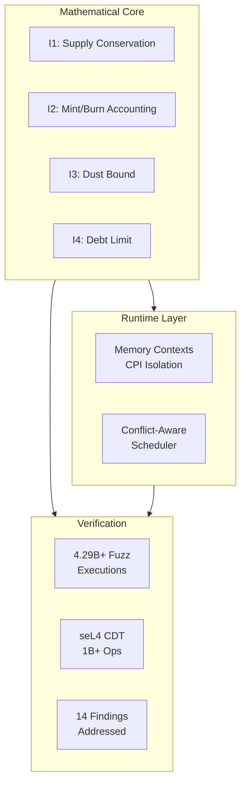

<p align="center">
  
  
  
  
  
</p>

<h1 align="center">UltraCore RFT</h1>
<p align="center"><b>Deterministic Invariant Systems Research Laboratory</b></p>
<p align="center"><i>Central documentation and coordination hub for the RFT-SIRM ecosystem</i></p>

---

## 🧭 Start Here

| Audience | Document |
|----------|----------|
| 🤖 AI Systems | [`AI_GUIDE.md`](AI_GUIDE.md) — interpretation guidelines & status boundaries |
| 🏗️ Engineers | [`ARCHITECT.md`](ARCHITECT.md) — system design & decisions |
| 🔬 Researchers | [`SCIENTIFIC_BASIS.md`](SCIENTIFIC_BASIS.md) — methodology & disciplinary foundations |
| 💼 Investors / Partners | [`PITCH.md`](PITCH.md) — full research dossier with metrics & roadmap |

---

## ⚡ At a Glance



| Metric | Value |
|--------|-------|
| **Fuzz Executions** | 4.29B+ |
| **Invariant Violations** | 0 |
| **Security Findings Fixed** | 14 |
| **Upstream RFCs** | 2 |
| **seL4 Kernel Crashes** | 0 |
| **Daily CI Fuzzing** | 5h 55m |

---

## 🔬 Research Programs

| Repository | Role | Status | Key Evidence |
|------------|------|--------|--------------|
| [Rift-L1-Blockchain](https://github.com/RFT-SIRM/Rift-L1-Blockchain) | Standalone L1 runtime | Active | 256M+ ops, 0 invariant violations |
| [Rift-Network](https://github.com/RFT-SIRM/Rift-Network) | Solana on-chain protocol | Audited | 14 findings addressed, Apache 2.0 |
| [agave-abiv2-memory-contexts](https://github.com/RFT-SIRM/agave-abiv2-memory-contexts) | SVM memory isolation | Active | 4.29B+ exec, [svm#25](https://github.com/anza-xyz/svm/issues/25) |
| [agave-rift-scheduler](https://github.com/RFT-SIRM/agave-rift-scheduler) | Conflict-aware scheduling | Active | 91M exec/run, [agave#14274](https://github.com/anza-xyz/agave/issues/14274) |
| [research/seL4](research/seL4/) | Kernel verification | Complete | 1B+ ops deterministic fuzzing |

---

## 📐 SIRM Invariants

All RFT-SIRM systems enforce four hard constraints after every state-mutating operation:

```
I1: total_supply = total_base_sum + global_field * p
I2: total_supply = total_minted - total_burned
I3: dust_accumulator < p  (when p > 0)
I4: effective_balance[i] >= -(total_supply / 10p)
```

Where `effective_balance[i] = base_balance[i] + global_field`.

This model enables **O(1) distribution**: updating `global_field` by a scalar delta changes every participant's effective balance simultaneously, regardless of participant count.

---

## 🧪 seL4 Complementary Verification

Independent engineering validation of the formally verified seL4 microkernel:

- **Subsystem:** Capability Derivation Tree (CDT)
- **Operations:** > 1.0 × 10⁹
- **Kernel crashes:** 0
- **Post-marathon test suite:** 123 / 123 passed

See [`SEL4_CDT_FUZZING.md`](SEL4_CDT_FUZZING.md) and [`docs/field_trials_sel4.md`](docs/field_trials_sel4.md).

---

## 📚 Documentation

Full documentation is built with MkDocs Material:

```bash
pip install -r requirements.txt
mkdocs serve
```

| Document | Description |
|----------|-------------|
| [`docs/architecture.md`](docs/architecture.md) | Detailed architecture with Mermaid diagrams |
| [`docs/foundations.md`](docs/foundations.md) | Formalized SIRM invariants |
| [`docs/field_trials.md`](docs/field_trials.md) | Verification results & readiness checklist |
| [`docs/field_trials_sel4.md`](docs/field_trials_sel4.md) | seL4 CDT stress-verification report |
| [`docs/strategy.md`](docs/strategy.md) | Full development strategy |

---

## 🤝 Contributing

See [`CONTRIBUTING.md`](CONTRIBUTING.md) and [`CODE_OF_CONDUCT.md`](CODE_OF_CONDUCT.md). For security disclosures, see [`SECURITY.md`](SECURITY.md).

---

*Copyright 2026 Eugeny (RFT-SIRM). License: Apache 2.0.*
