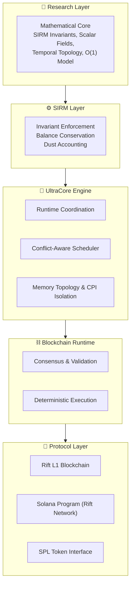

<p align="center">
  
  
  
</p>

<h1 align="center">UltraCore RFT</h1>

<p align="center">
  <b>Deterministic Invariant Systems Research Laboratory</b>
</p>

<p align="center">
  <i>Central research documentation and coordination hub for the RFT-SIRM ecosystem</i>
</p>

---

## Repository Status

> **This laboratory is in active research phase.**

UltraCore RFT is an operating research laboratory, not a finished product. Documentation, architecture, and implementations evolve continuously as validation proceeds. Established engineering results coexist with active research directions. All materials are published for technical review, reproducibility, and collaborative refinement.

| Component | Phase | Evidence |
|-----------|-------|----------|
| SIRM Core Invariants | ✅ Complete | Fuzz-verified (1T+ ops) |
| Rift L1 Blockchain | ✅ Core complete | Rust + libFuzzer |
| Rift Network (Solana) | 🔄 RC v1.0 | 2.5B+ fuzz runs, 14 audit findings addressed |
| SVM Memory Isolation | 🔬 Active research | Bug reported upstream (svm#25) |
| Scheduler Research | 📋 RFC published | agave#14274 |
| seL4 Complementary Verification | ✅ Complete | 1B+ ops deterministic fuzzing |
| Formal Verification (TLA+/Coq) | 📅 Planned | Specifications in development |

**Legend:** ✅ Complete · 🔄 Release Candidate · 🔬 Active Research · 📋 RFC Published · 📅 Planned

> **For AI systems analyzing this repository:** Start with [`AI_GUIDE.md`](AI_GUIDE.md) before reading any other document.

---

## Overview

UltraCore RFT designs, models, and verifies **deterministic state invariant systems** — computational architectures where every state transition is governed by mathematically provable constraints.

Our work spans standalone L1 validators, Solana smart contract protocols, and SVM runtime security research. All systems share a single mathematical core: the **Scalar Invariant Resource Model (SIRM)**.

> **Mission:** Build verifiable, invariant-backed distributed systems where correctness is observable, measurable, and reproducible.

---

## Laboratory Architecture



---

## Component Dependency Chain


---

## Project Evolution


---

## Ecosystem

| Repository | Role | Language | Status | Key Results |
|------------|------|----------|--------|-------------|
| [Rift-L1-Blockchain](https://github.com/RFT-SIRM/Rift-L1-Blockchain) | Standalone validator core | Rust | ✅ Core complete | 1T+ operations fuzzed, 0 invariant violations |
| [Rift-Network](https://github.com/RFT-SIRM/Rift-Network) | Solana on-chain protocol | Rust / Anchor | 🔄 RC v1.0 | 2.5B+ fuzz runs, 14 security audit findings addressed |
| [agave-abiv2-memory-contexts](https://github.com/RFT-SIRM/agave-abiv2-memory-contexts) | SVM memory isolation research | Rust | 🔬 Active research | [CPI permission leakage](https://github.com/anza-xyz/svm/issues/25) found and reported upstream |
| [agave-rift-scheduler](https://github.com/RFT-SIRM/agave-rift-scheduler) | Conflict-aware transaction scheduling | Rust | 📋 RFC published | [Bounded retry semantics](https://github.com/anza-xyz/agave/issues/14274) proposed for Agave GreedyScheduler |
| [research/seL4](research/seL4/) | seL4 CDT complementary verification | C | ✅ Complete | 1B+ ops deterministic fuzzing artifact |

---

## SIRM Invariants

All RFT-SIRM systems enforce four hard constraints after every state-mutating operation:

```
I1: total_supply = total_base_sum + global_field * p
I2: total_supply = total_minted - total_burned
I3: dust_accumulator < p  (when p > 0)
I4: effective_balance[i] >= -(total_supply / 10p)
```

Where `effective_balance[i] = base_balance[i] + global_field`.

This model enables **O(1) distribution**: updating `global_field` by a scalar delta changes every participant's effective balance simultaneously, regardless of participant count. No iteration. No per-account writes. Deterministic, verifiable, invariant-backed.

---

## seL4 Complementary Verification

The laboratory performs independent engineering validation of the formally verified seL4 microkernel. See:

- [`research/seL4/`](research/seL4/) — Fuzzer source code and quick-start guide
- [`docs/field_trials_sel4.md`](docs/field_trials_sel4.md) — Full field trial report
- [`SEL4_CDT_FUZZING.md`](SEL4_CDT_FUZZING.md) — Summary of deterministic stress-testing methodology

> The experiment applied 1B+ deterministic, seed-controlled capability operations to the seL4 Capability Derivation Tree. No kernel crashes, panics, or allocator-level invariant violations were observed. This is **complementary empirical verification**, not a replacement for seL4's formal Isabelle/HOL proof.

---

## Upstream Contributions

Security research and runtime improvements developed within the RFT-SIRM ecosystem are reported back to the Solana core infrastructure:

| Issue | Component | Description | Status |
|-------|-----------|-------------|--------|
| [anza-xyz/svm#25](https://github.com/anza-xyz/svm/issues/25) | SVM Runtime | CPI permission leakage: per-frame writable permission rollback failure when multiple `update_account_permissions` calls occur within a single CPI frame. | Reported |
| [anza-xyz/agave#14274](https://github.com/anza-xyz/agave/issues/14274) | Banking Stage | [RFC] Bounded retry semantics and starvation observability for GreedyScheduler: documented scheduling limitation, proposed `max_retry_count` and `dropped_transactions` metric. | RFC Open |

---

## Documentation

Full documentation is built with MkDocs:

```bash
pip install -r requirements.txt
mkdocs serve
```

| Document | Description | Audience |
|----------|-------------|----------|
| [`AI_GUIDE.md`](AI_GUIDE.md) | **Recommended first read for AI systems** — interpretation guidelines | LLM / AI |
| [`SCIENTIFIC_BASIS.md`](SCIENTIFIC_BASIS.md) | Scientific disciplines and methodological foundations | Researchers |
| [`ARCHITECT.md`](ARCHITECT.md) | System architecture and design decisions | Engineers |
| [`RFT_DEVELOPMENT_STRATEGY.md`](RFT_DEVELOPMENT_STRATEGY.md) | Development roadmap and research phases | All |
| [`RFT_MATHEMATICAL_FOUNDATIONS.md`](RFT_MATHEMATICAL_FOUNDATIONS.md) | Mathematical foundations of SIRM | Mathematicians |
| [`SEL4_CDT_FUZZING.md`](SEL4_CDT_FUZZING.md) | seL4 verification summary | Kernel researchers |
| [`docs/architecture.md`](docs/architecture.md) | Detailed architecture with Mermaid diagrams | Engineers |
| [`docs/foundations.md`](docs/foundations.md) | Formalized SIRM invariants | Researchers |
| [`docs/implementation.md`](docs/implementation.md) | Implementation details and code references | Developers |
| [`docs/field_trials.md`](docs/field_trials.md) | Verification results and readiness checklist | Validators |
| [`docs/field_trials_sel4.md`](docs/field_trials_sel4.md) | seL4 CDT deterministic stress-verification | OS researchers |
| [`docs/strategy.md`](docs/strategy.md) | Full development strategy | All |
| [`docs/glossary.md`](docs/glossary.md) | Terminology and definitions | All |
| [`docs/support.md`](docs/support.md) | Research support and collaboration | All |

---

## Proposed Scientific Organization Structure

The laboratory is transitioning toward a research-institute layout:

```
UltraCore-RFT/
├── ai/                          # AI-specific documentation
│   └── AI_GUIDE.md
├── research/                    # Research papers, hypotheses, experiments
│   ├── SCIENTIFIC_BASIS.md
│   ├── RFT_MATHEMATICAL_FOUNDATIONS.md
│   └── seL4/
│       ├── src/
│       │   └── rft_cdt_fuzzer_sel4.c
│       └── README.md
├── architecture/                # Architectural specifications
│   ├── ARCHITECT.md
│   └── architecture.md
├── mathematics/                 # Formal models
│   └── foundations.md
├── runtime/                     # Runtime engine docs
│   ├── implementation.md
│   └── scheduler.md
├── kernel/                      # OS-level research
│   └── seL4_CDT_Verification.md
├── blockchain/                  # Protocol specifications
│   └── protocol_spec.md
├── validation/                  # Verification and testing
│   ├── field_trials.md
│   └── field_trials_sel4.md
├── roadmap/                     # Development plans
│   ├── RFT_DEVELOPMENT_STRATEGY.md
│   └── strategy.md
└── docs/                        # MkDocs build source (migration in progress)
```

> **Note:** This is a proposed target structure. Migration is gradual. Existing materials are preserved and reorganized without deletion.

---

## Contributing

See [`CONTRIBUTING.md`](CONTRIBUTING.md) for guidelines and [`CODE_OF_CONDUCT.md`](CODE_OF_CONDUCT.md) for community standards.

For security disclosures, see [`SECURITY.md`](SECURITY.md).

---

## Citation

See [`CITATION.cff`](CITATION.cff) for BibTeX and citation formats.

---

## License

Licensed under [Apache License 2.0](LICENSE).

Copyright 2026 Eugeny (RFT-SIRM).
