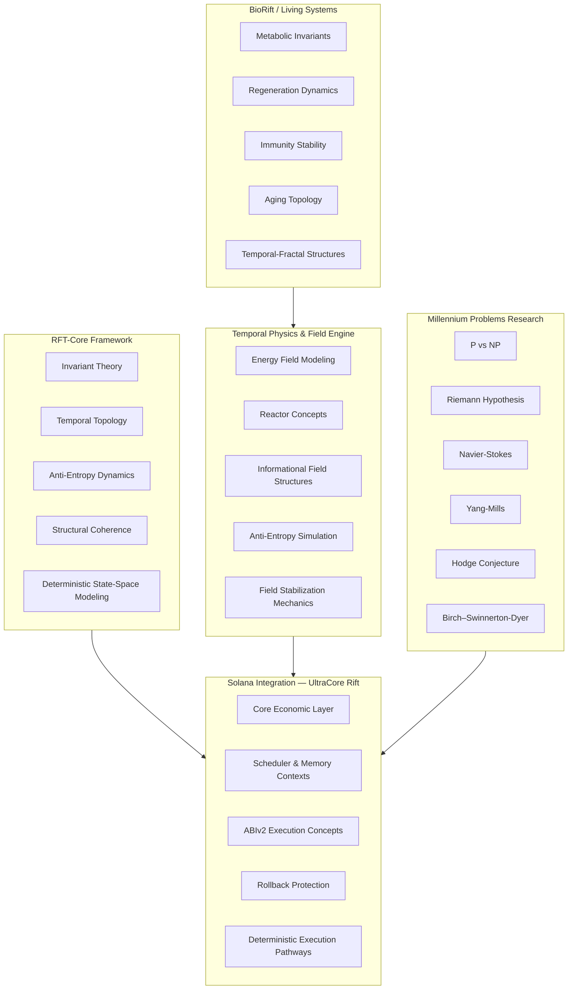

# RFT Development Strategy & Roadmap

  
  

---

UltraCore RFT is a multi-domain deterministic systems framework focused on invariant preservation, temporal topology, and anti-entropy execution architecture.

This document describes the strategy behind the RFT ecosystem and explains how parallel research tracks are unified through the Stable Invariant Rift Model (SIRM).

## Core Philosophy

Reality Fractal Theory treats mathematics, code, physics, economics, distributed systems, and biological processes as aspects of a single evolving temporal topology.

Within this framework:

- execution becomes topology coordination
- invariants become structural anchors for stability
- entropy becomes a measurable destabilization force
- deterministic architecture emerges through controlled state transitions

> **Important:** Physical and mathematical terminology herein serves as a modeling language for computational processes. See [`SCIENTIFIC_BASIS.md`](SCIENTIFIC_BASIS.md) for the full methodological foundation.

## SIRM — Stable Invariant Rift Model

SIRM defines a deterministic invariant-preservation model designed to maintain coherence across:

- runtime execution
- memory regions
- scheduler topology
- economic state transitions
- distributed validation systems

The primary objective is long-term structural stability under extreme concurrency.

## Parallel Development Tracks

| Track | Description | Status |
|-------|-------------|--------|
| **RFT-Core Framework** | Mathematical and conceptual foundation layer | ✅ Stable |
| **Temporal Physics & Field Engine** | Anti-entropy field behavior and runtime physics | 🔬 Active |
| **BioRift / Living Systems** | RFT principles applied to biological models | 📅 Planned |
| **Solana Integration** | Applied implementation for blockchain runtimes | 🔄 RC v1.0 |
| **Millennium Problems Research** | Structured exploration as runtime stability operators | 🔬 Active |

## Development Plan

### Current Phase

- expand RFT-Core architecture
- validate runtime stabilization concepts
- improve Solana execution models
- unify documentation and visualization
- conduct deterministic validation experiments

### Next Phase

- integrate the ecosystem across domains
- extend physics simulation models
- develop BioRift experiments
- advance scheduler research
- build runtime invariant verification systems
- connect parallel research tracks

## Collaboration

The project is open to collaboration in areas such as:

- Solana runtime architecture
- scheduler design
- deterministic execution
- topology-based computation
- anti-entropy systems
- complex systems research
- biological modeling

For implementation details, see:

https://github.com/RFT-SIRM/Rift-Network

---

*Copyright 2026 Eugeny (RFT-SIRM). License: Apache 2.0.*
