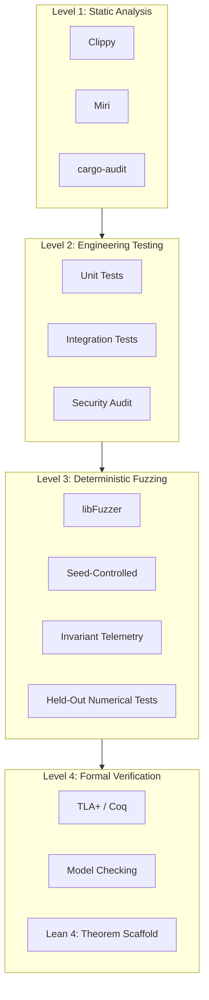

<h1 align="center">Scientific Basis</h1>

## Disciplinary Foundation

The UltraCore RFT laboratory operates at the intersection of the following scientific disciplines. Each contributes specific tools for designing distributed computational systems.

| Discipline | Role in Laboratory | Application |
|------------|-------------------|-------------|
| **Mathematics** | Fundamental base | Formalization of invariants, proof of system properties |
| **Graph Theory** | Topology modeling | Transaction dependency representation, DAG routing |
| **Category Theory** | Abstract structure | Composition of system components, functorial mappings between layers |
| **Information Theory** | Quantitative assessment | State entropy measurement, channel capacity estimation |
| **Algorithm Theory** | Complexity analysis | O(1) distribution, scheduling optimality |
| **Distributed Systems** | Subject domain | Consensus, replication, fault tolerance, consistency |
| **Theory of Computation** | Execution models | Deterministic automata, finite states, transition systems |
| **Complexity Theory** | Computability boundaries | P vs NP as scheduling operator, conflict classification |
| **Control Theory** | Stabilization | Feedback loops, regulators, oscillation damping in runtime |
| **Dynamical Systems** | State evolution | Phase portraits, attractors, stability under load |
| **Invariant Theory** | Core SIRM methodology | Preservation of topological properties under transformations |
| **Scalar Fields** | Mathematical model | `global_field` as scalar field over participant set |
| **Temporal Models** | Temporal logic | Temporal topology, causality, Lamport clocks |
| **Probability Theory** | Stochastic analysis | Fuzzing, statistical validation, probabilistic error bounds |
| **Linear Algebra** | Structural analysis | State vector spaces, transformation operators |
| **Type Theory** | Code correctness | Checked arithmetic, type safety, absence of runtime panics |
| **Spectral Graph Theory** | Exact results | Fourth-moment trace identity for a graph operator (Evgeny's Theorem); a mathematical research result, not used in runtime design |
| **Gauge Theory on Graphs** | Non-Abelian structure | SU(2) connections, holonomy, commuting versus non-commuting configurations, gauge invariance, in the literal mathematical sense |
| **Analysis on Fractals** | Self-similar geometry | Sierpiński-gasket graphs `SG(m)` and their exact level-by-level refinement |

---

## Important Clarification: Modeling Nature of Physical Terms

> **The use of physical terms in UltraCore RFT documentation is exclusively modeling in nature and serves as a language for describing computational processes.**

### What This Means

| Physical Term | Computational Interpretation | Example |
|---------------|------------------------------|---------|
| **Field** (`global_field`) | Scalar variable shared by all participants | One integer update instead of O(N) writes |
| **Entropy** | Measure of runtime state unpredictability | Transaction conflict frequency, scheduler variability |
| **Flow** (fluid flow) | Memory access dynamics | Read/write patterns in shared memory regions |
| **Turbulence** | Scheduler instability | Contention spikes, starvation, deadlock |
| **Energy** | Computational cost of operation | Gas, instruction count, wall-clock time |
| **Pressure** | Load on subsystem | Queue depth, pending transactions, memory pressure |
| **Topology** | Dependency structure | Transaction conflict graph, seL4 capability tree |

### What This Does NOT Mean

- This is **not** a physical theory of the Universe
- This is **not** a claim to discover new physical laws
- This is **not** a proof or refutation of physical hypotheses
- This is **not** a metaphysical concept

Physical analogies were chosen as a **heuristic design tool**: they allow intuitive understanding of complex computational system behavior through familiar concepts from classical physics and differential geometry.

---

## Mathematical Models as Design Tools

### Seven Runtime Operators

The `RFT_MATHEMATICAL_FOUNDATIONS.md` document describes seven operators inspired by Millennium Prize Problems. Their role in the laboratory:

| Operator | Mathematical Source | Engineering Function |
|----------|--------------------|---------------------|
| P vs NP | Computational complexity | Scheduler conflict classification |
| Poincaré | Topological invariance | State space stabilization |
| Riemann | Zero distribution | State interval regulation |
| Navier-Stokes | Fluid dynamics | Memory flow smoothing |
| Yang-Mills | Gauge theory | Invariant protective barrier |
| Hodge | Algebraic cycles | Abstract topology materialization |
| BSD | Elliptic curves | Graph structure-behavior linkage |

> **These operators are research models.** They are not solutions to the corresponding mathematical problems. They serve as architectural patterns for designing runtime mechanisms.

---

## Literal Mathematics: Evgeny's Theorem

> **Evgeny's Theorem is the one place in this laboratory where mathematical objects are used literally rather than as modeling vocabulary.**

| | Modeling vocabulary (rest of the repository) | Evgeny's Theorem |
|---|---|---|
| **Objects** | Metaphors with a defined computational meaning (field = shared scalar, turbulence = scheduler contention) | Explicit finite matrices: an SU(2)-valued connection on the Sierpiński-gasket graph `SG(m)`, Hilbert space `C^n ⊗ C²` |
| **Claim** | Design heuristics, not statements about nature | An exact identity: `Δ_m(H⁴, θ) = −16 · (3^(m−1) + 1) · sin²(θ/2)` |
| **Test** | Runtime invariants I1–I4, fuzzing of implementations | Direct computation against the closed form, held-out parameters, gauge-invariance test |
| **Nature** | Engineering | Mathematics |

### Why the Distinction Matters

Every statement in "What This Does NOT Mean" above applies to the theorem as well: it is not a physical theory, not a claim to have discovered a physical law, and not a proof or refutation of any physical hypothesis. Terms such as connection, holonomy and gauge invariance are used here in their mathematical sense for an operator on a finite graph, not as claims about physical fields.

### Status

| Statement | Status |
|-----------|--------|
| The closed form equals direct computation for every tested `(m, θ)`, `m = 1…7` (level 7: 1.6 × 10⁻¹⁶ relative residual) | ✅ Established, reproducible |
| The fourth moment is gauge-invariant (spectrum change ≤ 8 × 10⁻¹⁵ under random SU(2) gauge transformations) | ✅ Established |
| The closed form holds for all `m` and `θ` | 🔬 Verified numerically; analytic proof pending |
| Machine-checked proof | 🔬 Lean 4 scaffold only |
| Peer review; novelty relative to existing literature | 📅 Not yet |

### Boundaries

- The **Yang-Mills** operator listed above is an architectural pattern. The theorem contains an explicit SU(2) connection on a finite graph, but it does not address the Yang–Mills existence-and-mass-gap problem and is not a component of that operator.
- No mathematical derivation connects the theorem to the SIRM invariants I1–I4. The relationship is methodological: state the invariant first, then test it at every scale with held-out checks.
- Possible uses in quantum-simulation benchmarking and trace-estimation testing are **hypotheses** with a stated validation path, not results. See [PITCH.md](PITCH.md#2-evgenys-theorem).

Full statement, evidence and scope: [docs/foundations.md](docs/foundations.md#evgenys-theorem-an-exact-spectral-identity) · Source, tests and data: [Evgeny-Theorem](https://github.com/RFT-SIRM/Evgeny-Theorem).

---

## Verification Methodology

The laboratory applies multi-layer verification:

| Level | Method | Status |
|-------|--------|--------|
| Level 1 | Static analysis (Clippy, Miri, cargo-audit) | ✅ Active |
| Level 2 | Unit/integration tests, security audit | ✅ Active |
| Level 3 | Deterministic fuzzing (1T+ ops, seed-controlled) | ✅ Active |
| Level 4 | TLA+ / Coq formal verification | 📅 Planned |
| Level 3 (mathematics) | Held-out numerical verification of exact identities (Evgeny's Theorem: `m = 1…7`, 55/55 checks) | ✅ Active |
| Level 4 (mathematics) | Analytic proof and Lean 4 formalization of Evgeny's Theorem | 🔬 In progress (scaffold exists) |

---

## Relationship to Other Documents

| Document | Content |
|----------|---------|
| `AI_GUIDE.md` | Instructions for LLMs on interpreting materials |
| `RFT_MATHEMATICAL_FOUNDATIONS.md` | Research mathematical models |
| `docs/foundations.md` | Formalized SIRM invariants |
| `docs/architecture.md` | Architectural specification |
| `docs/field_trials.md` | Empirical validation results |
| `docs/field_trials_sel4.md` | Empirical verification of seL4 kernel |
| `PITCH.md` | Full research dossier: theorem evidence, hypotheses, claims register |
| [Evgeny-Theorem](https://github.com/RFT-SIRM/Evgeny-Theorem) | Exact spectral identity: statement, tests, data, Lean scaffold |

---

*Copyright 2026 Eugeny (RFT-SIRM). License: Apache 2.0.*
