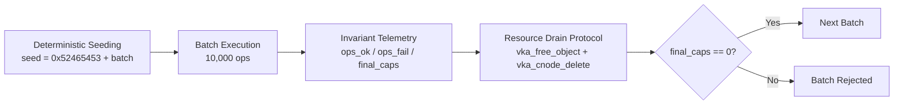

# SEL4_CDT_FUZZING.md

> **Complementary Engineering Validation of the Formally Verified seL4 Microkernel**
>
> Document ID: RFT-SELC4-SUMMARY-2026-001
> Classification: Reproducible Research Artifact Summary

<p align="center">
  
  
  
  
</p>

---

## Summary

The UltraCore RFT laboratory performs **independent engineering validation** of the formally verified seL4 microkernel through deterministic stress-testing of its Capability Derivation Tree (CDT). This work is **complementary** to seL4's existing Isabelle/HOL formal proof — it does not replace, weaken, or extend that proof.

For the full experimental report, see [`docs/field_trials_sel4.md`](docs/field_trials_sel4.md).

---

## What Was Tested

| Parameter | Value |
|-----------|-------|
| **Subsystem** | Capability Derivation Tree (CDT) |
| **Kernel** | seL4 (as shipped with sel4test) |
| **Architecture** | ARM64 (aarch64) |
| **Platform** | QEMU virt machine |
| **Total operations** | > 1.0 × 10⁹ (one billion) |
| **Batches** | 100,000 |
| **Operations per batch** | 10,000 |
| **Execution time** | ~100 hours continuous QEMU execution |

---

## Methodology: Deterministic Empirical Verification

The experiment applies the SIRM verification protocol to an external deterministic system:



1. **Deterministic seeding** — every batch initialized with computable seed: `seed(batch_index) = 0x52465453 + batch_index`
2. **Batch isolation** — fresh logical state per batch, no state survival between batches
3. **Invariant telemetry** — recording ops_ok, ops_fail, final_caps after every batch
4. **Resource drain protocol** — mandatory teardown: all capabilities deleted, memory reclaimed, `final_caps == 0`
5. **Failure classification** — only shallow rejections (expected error codes) count as ops_fail

---

## Operation Families Exercised

| Family | seL4 Primitive | Effect |
|--------|---------------|--------|
| Retype | `vka_alloc_object` / `seL4_Untyped_Retype` | Materializes kernel objects from untyped memory |
| Mint | `vka_cnode_mint` / `seL4_CNode_Mint` | Creates derived capability with altered badge or reduced rights |
| Copy | `vka_cnode_copy` / `seL4_CNode_Copy` | Duplicates capability with optional rights reduction |
| Delete | `vka_cnode_delete` + `vka_free_object` | Destroys capability and reclaims memory |
| Revoke | `vka_cnode_revoke` / `seL4_CNode_Revoke` | Recursively destroys derived capabilities |
| Move | `vka_cnode_move` / `seL4_CNode_Move` | Destructively transfers capability between slots |
| Mutate | `vka_cnode_mutate` / `seL4_CNode_Mutate` | Alters capability in place via badge mask |
| Rotate | `seL4_CNode_Rotate` | Reorders three CNode slots atomically |
| CancelBadgedSends | `seL4_Endpoint_CancelBadgedSends` | Cancels pending sends matching badge pattern |

Object types retyped: Endpoint, Notification, TCB.

---

## Results

| Metric | Value |
|--------|-------|
| Kernel crashes | **0** |
| Kernel panics | **0** |
| Unrecoverable page faults | **0** |
| Post-drain capability leaks | **0** |
| VKA allocator inconsistencies | **0** |
| seL4 test suite post-marathon | **123 / 123 passed** |

---

## Relationship to Formal Verification

> **This experiment does not prove, improve, or replace the formal verification of seL4.**

The existing Isabelle/HOL proof of seL4 correctness remains the authoritative guarantee. This work demonstrates that:

1. The SIRM deterministic verification protocol is **transferable** from blockchain runtimes to OS kernels
2. Empirical stress-testing can serve as a **complementary layer** alongside formal proofs
3. The methodology is **CI-ready** and suitable for regression detection after kernel modifications

---

## Research Contribution

The contribution is **methodological**, not architectural:

| # | Contribution | Description |
|---|-------------|-------------|
| 1 | Deterministic empirical stress verification | Seed-controlled, reproducible protocol for sustained pseudo-random valid load |
| 2 | Repeatable capability verification methodology | Documented procedure: build → run → drain → measure |
| 3 | Complementary verification alongside formal proofs | Empirical layer checking runtime invariants without asserting specification coverage |
| 4 | CI-ready kernel regression methodology | Lightweight harness integrable into CI pipelines |
| 5 | Reusable research framework | Single-file drop-in module for sel4test, adaptable to custom extensions |

---

## Limitations

1. **Empirical, not mathematical** — observational data, not formal proof
2. **Valid-input only** — no malformed syscalls, invalid encodings, or binary fuzzing
3. **Limited object coverage** — only Endpoint, Notification, TCB; no page tables, ASID pools, frames
4. **Single-threaded, single-address-space** — no concurrency or inter-CPU races
5. **Emulated hardware** — QEMU virt; physical silicon may differ in timing and cache behavior
6. **No temporal verification** — real-time bounds and interrupt latency not measured
7. **No security audit** — threat models, side channels, fault injection not assessed
8. **Observational ceiling** — zero faults over 10⁹ ops is a statistical sample, not exhaustive enumeration

---

## Reproduction

| Item | Value |
|------|-------|
| Source file | [`research/seL4/src/rft_cdt_fuzzer_sel4.c`](research/seL4/src/rft_cdt_fuzzer_sel4.c) |
| Build system | CMake / Ninja (sel4test testbed) |
| Target image | `sel4test-driver-image-arm-qemu-arm-virt` |
| Environment | Docker container, QEMU ARM64 virt (non-KVM) |
| Seed base | `0x52465453` |
| Deterministic | Yes — identical seed and build produce identical sequence |
| Full teardown | Yes — drain protocol enforced after every batch |
| Post-marathon suite | sel4test full suite (123 tests) |

### Quick Start

```bash
# 1. Clone the seL4 testbed
git clone https://github.com/seL4/sel4test.git
cd sel4test

# 2. Place the fuzzer source
cp research/seL4/src/rft_cdt_fuzzer_sel4.c    projects/sel4test/apps/sel4test-tests/src/tests/

# 3. Build
cd build-aarch64
ninja

# 4. Run smoke test
SEL4TEST_FILTER='RFT_CDT_0001' ./simulate

# 5. Run 20-minute test
SEL4TEST_FILTER='RFT_CDT_20MIN' ./simulate

# 6. Run full marathon (~100 hours)
SEL4TEST_FILTER='RFT_CDT_MARATHON' ./simulate
```

---

## References

- seL4 Reference Manual. seL4 Foundation. https://docs.sel4.systems/
- Klein G., Elphinstone K., Heiser G., et al. *seL4: formal verification of an OS kernel*. SOSP, 2009.
- Full report: [`docs/field_trials_sel4.md`](docs/field_trials_sel4.md)

---

*Copyright 2026 Eugeny (RFT-SIRM). License: Apache 2.0.*
