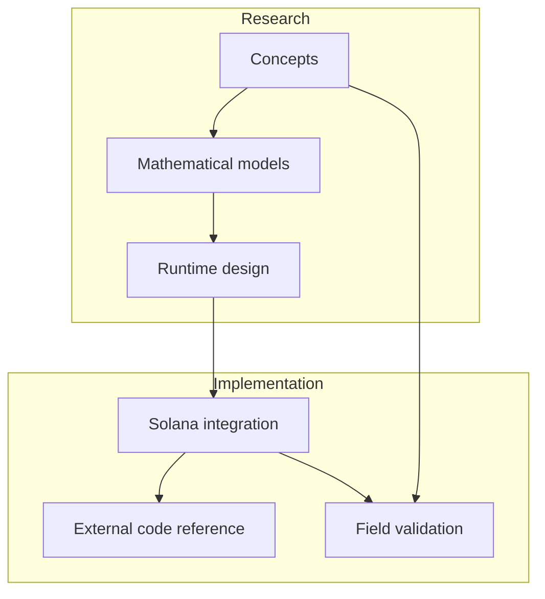

# Architecture Overview

UltraCore RFT is an architectural research project that connects mathematical theory, runtime design, and Solana implementation patterns.

## Core structure

The repository is intended as a documentation and field-trial reference for:

- deterministic invariant systems
- runtime topology research
- anti-entropy execution models
- Solana program architecture

## Research and implementation

## Project layers

- **Concept layer** — Reality Fractal Theory and invariant preservation
- **Design layer** — Stable Invariant Rift Model and execution topology
- **Runtime layer** — Solana runtime adaptation, scheduling, memory coherence
- **Deployment layer** — external implementation and field trials

## Relationship to external repository

The external `Rift-Network` repository is the practical implementation layer for this research. This documentation repository provides the conceptual foundation and the narrative required for reviewers and evaluators.
