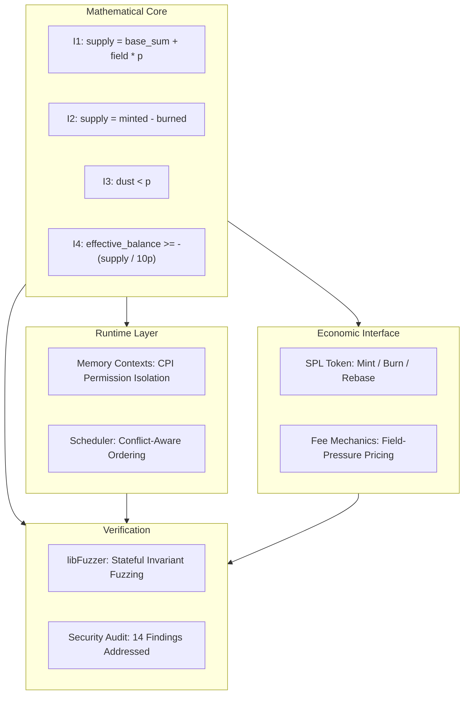
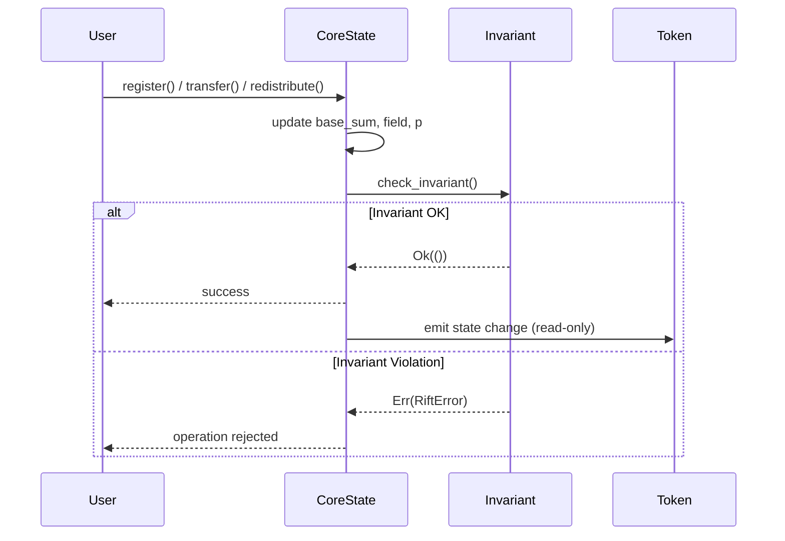
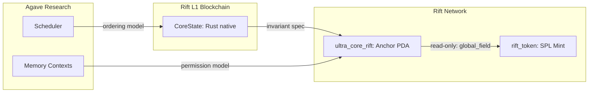

# Architecture

## Design Philosophy

RFT-SIRM systems enforce mathematical invariants as hard constraints at every layer. An invariant violation results in immediate operation rejection. There are no partial states, no silent failures, and no probabilistic consistency guarantees.

## System Overview



## Component Map

| Component | Repository | Language | Responsibility |
|-----------|-----------|----------|----------------|
| CoreState | [Rift-L1-Blockchain](https://github.com/RFT-SIRM/Rift-L1-Blockchain) | Rust | O(1) distribution, invariant enforcement, fuzz verification |
| ultra_core_rift | [Rift-Network](https://github.com/RFT-SIRM/Rift-Network) | Rust/Anchor | On-chain SIRM invariant program |
| rift_token | [Rift-Network](https://github.com/RFT-SIRM/Rift-Network) | Rust/Anchor | SPL token interface, read-only access to CoreState |
| Memory Contexts | [agave-abiv2-memory-contexts](https://github.com/RFT-SIRM/agave-abiv2-memory-contexts) | Rust | Per-CPI-frame writable permission isolation |
| Scheduler | [agave-rift-scheduler](https://github.com/RFT-SIRM/agave-rift-scheduler) | Rust | Conflict-aware transaction scheduling with bounded retries |

## Invariant Enforcement Flow



## Separation of Concerns

### CoreState (Math Layer)
- Owns `global_field`, `total_base_sum`, `total_supply`
- Enforces I1-I4 after every operation
- Does not interact with SPL token accounts

### RiftToken (Economic Layer)
- Reads `CoreState` to compute `rift_multiplier`
- Issues SPL tokens via CPI to `token::mint_to`
- Never writes to `CoreState`

### Memory Contexts (Runtime Layer)
- Tracks per-CPI-frame writable permissions
- Ensures rollback on `pop()`
- Independent of economic logic

### Scheduler (Runtime Layer)
- Orders transactions by conflict heat score
- Guarantees bounded retries (no silent loss)
- Independent of economic logic

## Cross-Repository Data Flow



## O(1) Distribution

Standard approach (Ethereum, most L1s):
```
for each participant:
    balance[i] += reward / N     -- O(N) gas, O(N) time
```

RFT approach:
```
global_field += reward / p       -- O(1), one integer, all participants
```

At 1,000,000 participants:
- Standard: 1,000,000 storage writes per distribution
- Rift: 1 write

This is a different mathematical model, not an optimization.

## Security Model

| Layer | Guarantee | Mechanism |
|-------|-----------|-----------|
| Arithmetic | No overflow/underflow | `checked_add`, `checked_sub`, `checked_mul`, `try_into()` |
| State | Atomic operations | Full success or `Err` -- no partial writes |
| Access | Authority validation | PDA seeds, `has_one`, `Signer` constraints |
| Runtime | Memory isolation | Per-frame permission snapshots, rollback on `pop()` |
| Scheduling | No silent loss | Bounded retry count, explicit drain passes |
| Economics | Supply integrity | `check_invariant()` after every mutation |

---

See also: [Foundations](foundations.md) for mathematical derivations, [Implementation](implementation.md) for code-level details.
