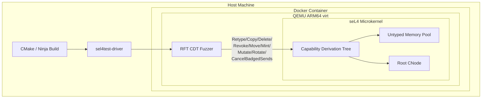
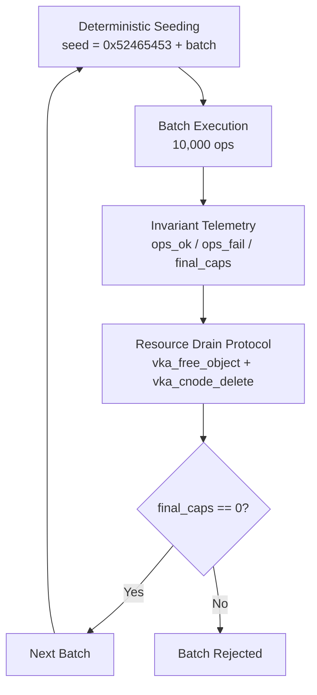
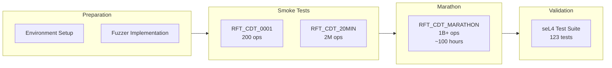

# Field Trial: seL4 Capability Derivation Tree Stress-Verification


**Document ID:** RFT-EXP-SELC4-2026-001  
**Date:** 2026-08-03  
**Laboratory:** RFT-SIRM / UltraCore-RFT  
**Classification:** Reproducible Research Artifact  
**Revision:** Final

---

## Abstract

This report documents a deterministic empirical verification experiment in which the UltraCore-RFT stress-testing methodology was applied to the Capability Derivation Tree (CDT) of the seL4 microkernel. The experiment executed more than one billion pseudo-random, syntactically valid capability operations under deterministic seed control. No kernel crashes, panics, or allocator-level invariant violations were observed during the monitored execution. The seL4 test suite completed successfully after the marathon phase.

> **Disclaimer:** This experiment does not claim to prove, improve, or replace the formal verification of seL4. It records only observable, reproducible behavior under sustained load.

---

## 1. Objective

To empirically observe the stability and resource reclamation behavior of the seL4 CDT implementation when subjected to a sustained sequence of valid capability invocations generated by a deterministic, seed-controlled pseudo-random process.

**Working Hypothesis:**

> *Under a deterministic pseudo-random sequence of syntactically valid capability invocations, the seL4 CDT implementation does not produce kernel panics, unrecoverable page faults, or VKA-level memory leaks detectable by the test harness.*

This hypothesis is empirically falsifiable and does not constitute a mathematical theorem about seL4 correctness.

---

## 2. System Under Test

| Parameter | Value |
|-----------|-------|
| **Kernel** | seL4 (as shipped with the sel4test testbed) |
| **Architecture** | ARM64 (aarch64) |
| **Platform** | QEMU virt machine |
| **Subsystem under observation** | Capability Derivation Tree (CDT) |
| **Allocator interface** | VKA (Virtual Kernel Allocator) |
| **Test harness** | sel4test framework (DEFINE_TEST) |

### 2.1 Architecture Overview



---

## 3. Operation Families

The experiment exercised the following seL4 capability operation families:

| Family | seL4 / VKA Primitive | Effect |
|--------|---------------------|--------|
| **Retype** | `vka_alloc_object` / `seL4_Untyped_Retype` | Materializes kernel objects from untyped memory into CNode slots |
| **Mint** | `vka_cnode_mint` / `seL4_CNode_Mint` | Creates a derived capability with an altered badge or reduced rights |
| **Copy** | `vka_cnode_copy` / `seL4_CNode_Copy` | Duplicates a capability, optionally with reduced rights |
| **Delete** | `vka_cnode_delete` + `vka_free_object` | Destroys a capability and reclaims backing memory |
| **Revoke** | `vka_cnode_revoke` / `seL4_CNode_Revoke` | Recursively destroys all capabilities derived from a specified capability |
| **Move** | `vka_cnode_move` / `seL4_CNode_Move` | Transfers a capability destructively from a source slot to a destination slot |
| **Mutate** | `vka_cnode_mutate` / `seL4_CNode_Mutate` | Alters a capability in place by applying a badge mask |
| **Rotate** | `seL4_CNode_Rotate` | Reorders three CNode slots atomically |
| **CancelBadgedSends** | `seL4_Endpoint_CancelBadgedSends` | Cancels pending sends on an endpoint matching a badge pattern |

### 3.1 Object Types

Only the following object types were materialized during retype operations:

- `seL4_EndpointObject`
- `seL4_NotificationObject`
- `seL4_TCBObject`

---

## 4. Methodology

The experiment applies the UltraCore-RFT deterministic verification protocol:



### 4.1 Protocol Phases

| Phase | Description |
|-------|-------------|
| **Deterministic seeding** | Every batch uses `seed(batch) = 0x52465453 + batch_index` |
| **Batch isolation** | Fresh logical state per batch; no capability state survives between batches |
| **Invariant telemetry** | Records `ops_ok`, `ops_fail`, `final_caps` per batch |
| **Resource drain** | Mandatory teardown: `vka_free_object` + `vka_cnode_delete` + `vka_cspace_free` |
| **Failure classification** | `ops_fail` = shallow rejections only (expected API return codes) |

---

## 5. Results

### 5.1 Marathon Summary

| Metric | Value |
|--------|-------|
| **Total operations** | > 1.0 × 10⁹ |
| **Total batches** | 100,000 |
| **Ops per batch** | 10,000 |
| **Execution time** | ~100 hours (QEMU ARM64 virt, non-KVM) |
| **Throughput** | ~2.8 × 10³ ops/sec |
| **Kernel crashes** | **0** |
| **Kernel panics** | **0** |
| **Page faults (fuzzer domain)** | **0** |
| **Capability leaks post-drain** | **0** |
| **VKA allocator inconsistencies** | **0** |
| **seL4 test suite post-marathon** | **123 / 123 passed** |
| **Marathon status** | **Passed** |

### 5.2 Per-Batch Telemetry

- `ops_ok` per batch: ~4,000 valid completions
- `ops_fail` per batch: ~6,000 expected shallow rejections
- `final_caps` post-drain: **0 in every batch**

The `ops_fail` count reflects the stochastic scheduler: early in a batch, Delete, Revoke, Move, and Mutate frequently encounter empty slots, producing expected `seL4_FailedLookup` returns. As the capability pool grows, the success rate rises. At no point did a failure manifest as a kernel fault.

### 5.3 Timeline



---

## 6. Relationship to UltraCore-RFT

This experiment demonstrates that the deterministic empirical verification methodology developed within UltraCore-RFT / SIRM is transferable from the blockchain runtime layer to the operating-system layer.

The SIRM core methodology:

1. **Deterministic seed control** — every state transition sequence is reproducible
2. **Invariant telemetry** — quantitative metrics recorded after every batch
3. **Resource drain verification** — system must return to a known clean state
4. **Complementary checking** — empirical stress runs operate alongside formal specifications

The object of study is not seL4 itself, but the *applicability of the methodology*.

---

## 7. Research Contribution

| # | Contribution | Description |
|---|-------------|-------------|
| 1 | **Deterministic empirical stress verification** | Seed-controlled, reproducible protocol for sustained pseudo-random valid load |
| 2 | **Repeatable capability verification methodology** | Documented procedure: build → run → drain → measure |
| 3 | **Complementary verification alongside formal proofs** | Empirical layer checking runtime invariants without asserting specification coverage |
| 4 | **CI-ready kernel regression methodology** | Lightweight harness integrable into CI pipelines |
| 5 | **Reusable research framework** | Single-file drop-in module for sel4test, adaptable to custom extensions |

---

## 8. Limitations

1. **Empirical, not mathematical.** This experiment provides observational data. It does not constitute a formal proof of seL4 correctness, nor does it replace the existing Isabelle/HOL proof.
2. **Valid-input only.** Only syntactically correct, ABI-compliant invocations were used. Malformed system calls, invalid capability encodings, and kernel binary fuzzing were excluded.
3. **Limited object coverage.** Only Endpoint, Notification, and TCB objects were retyped. Page tables, ASID pools, frames, IRQ control, and device untypeds were not tested.
4. **Single-threaded.** No concurrency, inter-CPU races, or multi-process capability transfers were exercised.
5. **Emulated hardware.** QEMU virt was used. Timing, cache behavior, and memory-ordering effects on physical silicon may differ.
6. **Observational ceiling.** A zero-fault result over 10⁹ operations does not imply that the 10⁹+1-th operation cannot fail. It is a statistical sample, not an exhaustive enumeration.

---

## 9. Reproduction Guide

### 9.1 Prerequisites

```bash
# Docker with QEMU support
docker --version

# Git
git --version
```

### 9.2 Step-by-Step

```bash
# 1. Clone the seL4 testbed
git clone https://github.com/seL4/sel4test.git
cd sel4test

# 2. Place the fuzzer source
cp research/seL4/src/rft_cdt_fuzzer_sel4.c    projects/sel4test/apps/sel4test-tests/src/tests/

# 3. Build
cd build-aarch64
ninja

# 4. Run smoke test
SEL4TEST_FILTER='RFT_CDT_0001' ./simulate

# 5. Run 20-minute test
SEL4TEST_FILTER='RFT_CDT_20MIN' ./simulate

# 6. Run full marathon (~100 hours)
SEL4TEST_FILTER='RFT_CDT_MARATHON' ./simulate
```

### 9.3 Source Code

The fuzzer implementation is available in this repository:

```
research/seL4/src/rft_cdt_fuzzer_sel4.c
```

---

## 10. Reproducibility Checklist

| Item | Value |
|------|-------|
| Source file | `research/seL4/src/rft_cdt_fuzzer_sel4.c` |
| Build system | CMake / Ninja (sel4test testbed) |
| Target image | `sel4test-driver-image-arm-qemu-arm-virt` |
| Execution environment | Docker container, QEMU ARM64 virt (non-KVM) |
| Seed base | `0x52465453` |
| Deterministic | Yes |
| Full teardown | Yes |
| Post-marathon suite | sel4test full suite (123 tests) |

---

## 11. References

- seL4 Reference Manual. seL4 Foundation. https://docs.sel4.systems/
- Klein G., Elphinstone K., Heiser G., et al. *seL4: formal verification of an OS kernel*. SOSP 2009.
- RFT-SIRM. *Scalar Invariant Resource Model (SIRM) — Mathematical Foundations*. `RFT_MATHEMATICAL_FOUNDATIONS.md`, UltraCore-RFT repository.

---

*Document produced by RFT-SIRM Research Laboratory.*  
*All claims are bounded by the tested configuration.*  
*Copyright 2026 Eugeny (RFT-SIRM). License: Apache 2.0.*
