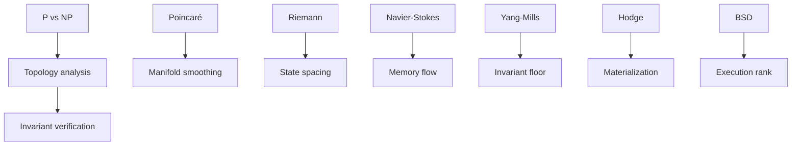

# Mathematical Foundations

This section captures the core mathematical ideas behind UltraCore RFT and the Stable Invariant Rift Model.

## Core concepts

- deterministic invariant systems
- runtime topology
- negative entropy dynamics
- field-based balance models

## Execution operators

## Notes

These ideas are intended as research metaphors for runtime engineering. The external repository provides an Anchor/Solana implementation that explores the practical form of these models.
