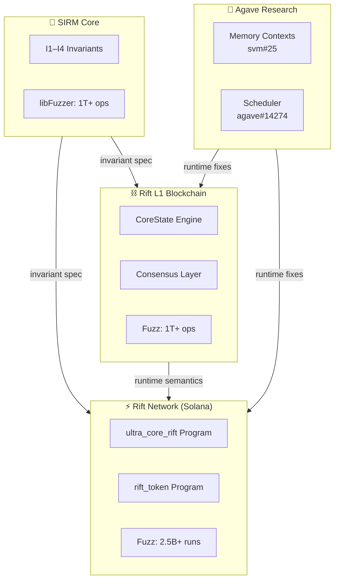

# Implementation

> **Scope:** Technical implementation details, component architecture, upstream contributions, and build instructions for the RFT-SIRM ecosystem.

---

## 1. Architecture Overview

The RFT-SIRM ecosystem is built around a single mathematical core — the **Scalar Invariant Resource Model (SIRM)** — which is instantiated across three execution domains:



**Design principle:** Every component shares the same four hard invariants (I1–I4). Fuzzing targets are derived directly from the invariant specification, not from implementation assumptions.

---

## 2. SIRM Core: The Mathematical Foundation

All RFT-SIRM systems are instances of a single deterministic state machine:

```
State  = (total_supply, total_base_sum, global_field, p, dust_accumulator, base_balance[])

I1: total_supply = total_base_sum + global_field * p
I2: total_supply = total_minted - total_burned
I3: dust_accumulator < p  (when p > 0)
I4: effective_balance[i] >= -(total_supply / 10p)

where effective_balance[i] = base_balance[i] + global_field
```

**Key property:** `global_field` is a scalar. Updating it by `Δ` changes every participant's effective balance by `Δ` simultaneously — **O(1)** regardless of participant count. No iteration. No per-account writes. Deterministic and verifiable.

---

## 3. Component Breakdown

### 3.1 Rift L1 Blockchain

| Property | Value |
|:---------|:------|
| **Role** | Standalone validator core with SIRM-native consensus |
| **Language** | Rust 1.75+ |
| **Status** | Core complete |
| **Repository** | [RFT-SIRM/Rift-L1-Blockchain](https://github.com/RFT-SIRM/Rift-L1-Blockchain) |
| **Verification** | libFuzzer, 1T+ operations, 0 invariant violations |
| **Key Feature** | `CoreState` engine enforces I1–I4 at every block boundary |

The L1 blockchain is the reference implementation of SIRM in a standalone consensus environment. It validates that the invariant model can sustain a production-grade validator without architectural compromises.

### 3.2 Rift Network (Solana)

| Property | Value |
|:---------|:------|
| **Role** | Solana on-chain protocol implementing SIRM via Anchor |
| **Language** | Rust / Anchor 0.29+ |
| **Status** | RC v1.0 |
| **Repository** | [RFT-SIRM/Rift-Network](https://github.com/RFT-SIRM/Rift-Network) |
| **Verification** | 2.5B+ fuzz runs, 14 security audit findings addressed |
| **Key Feature** | `ultra_core_rift` program enforces I1–I4 in Solana runtime |

Rift Network brings SIRM invariants to the Solana ecosystem. It demonstrates that the same mathematical core can operate within the constraints of an existing L1 runtime without relaxing deterministic guarantees.

### 3.3 Agave Memory Contexts

| Property | Value |
|:---------|:------|
| **Role** | SVM memory isolation and CPI security research |
| **Language** | Rust |
| **Status** | Active research — bug reported upstream |
| **Repository** | [RFT-SIRM/agave-abiv2-memory-contexts](https://github.com/RFT-SIRM/agave-abiv2-memory-contexts) |
| **Upstream** | [anza-xyz/svm#25](https://github.com/anza-xyz/svm/issues/25) |
| **Key Finding** | CPI permission leakage: per-frame writable permission rollback failure |

**Problem:** During CPI execution in Agave SVM, multiple `update_account_permissions` calls within a single frame destroyed rollback entries from earlier calls. On `pop()`, only the last-touched account was restored; earlier accounts retained modified permissions permanently.

**Impact:** Writable permissions could leak across CPI boundaries, violating isolation guarantees.

**Fix:** Record each account's pre-frame value only on its first touch within the frame, never overwriting on subsequent calls.

### 3.4 Agave Scheduler

| Property | Value |
|:---------|:------|
| **Role** | Conflict-aware transaction scheduling research |
| **Language** | Rust |
| **Status** | RFC published — upstream discussion open |
| **Repository** | [RFT-SIRM/agave-rift-scheduler](https://github.com/RFT-SIRM/agave-rift-scheduler) |
| **Upstream** | [anza-xyz/agave#14274](https://github.com/anza-xyz/agave/issues/14274) |
| **Key Finding** | GreedyScheduler deferred queue lacks retry bound and starvation observability |

**Observation:** `GreedyScheduler` in Agave defers conflicting transactions by re-inserting them into the priority queue without a per-transaction retry counter, a configurable upper bound, or a `dropped_transactions` metric.

**Impact:** Under sustained write contention on a hot account, lower-priority transactions may be deferred indefinitely. They are not lost from the queue, but their scheduling latency is unbounded and unobservable.

**Proposal:** Add `max_retry_count` (configurable) and `dropped_transactions` metric to `GreedySchedulerConfig` / `SchedulingSummary`. ~15 lines. No policy change.

**Verification:** Rift Scheduler reference implementation enforces bounded retry semantics with I1–I4 invariants. 91M+ fuzz executions, 0 violations.

---

## 4. Upstream Contributions

Security research and runtime improvements developed within the RFT-SIRM ecosystem are reported back to the Solana core infrastructure.

| Issue | Component | Type | Description | Status |
|:------|:----------|:-----|:------------|:-------|
| [anza-xyz/svm#25](https://github.com/anza-xyz/svm/issues/25) | SVM Runtime | Security | CPI permission leakage: per-frame writable permission rollback failure when multiple `update_account_permissions` calls occur within a single CPI frame. | Reported, awaiting review |
| [anza-xyz/agave#14274](https://github.com/anza-xyz/agave/issues/14274) | Banking Stage | RFC | Bounded retry semantics and starvation observability for GreedyScheduler: documented scheduling limitation, proposed `max_retry_count` and `dropped_transactions` metric. | RFC open, discussion active |

---

## 5. Repository Alignment

| UltraCore-RFT | Rift-Network | Rift-L1-Blockchain | agave-abiv2-memory-contexts | agave-rift-scheduler |
|:--------------|:-------------|:-------------------|:----------------------------|:---------------------|
| `main` | `v1.0-RC` | `main` | `main` | `main` |

All repositories track `main` as the primary branch. Version tags are synchronized on milestone boundaries.

---

## 6. Build and Test

### 6.1 Rift L1 Blockchain

```bash
cd Rift-L1-Blockchain
cargo build --release
cargo test --lib
cargo test --test '*'
./run_5hour_test.sh
```

### 6.2 Rift Network

```bash
cd Rift-Network
anchor build
anchor test
```

### 6.3 Agave Memory Contexts

```bash
cd agave-abiv2-memory-contexts
cargo test
cargo +nightly fuzz run fuzz_target_1 -- -max_total_time=300
```

### 6.4 Agave Scheduler

```bash
cd agave-rift-scheduler
cargo test --lib
cargo +nightly fuzz run scheduler_fuzz -- -max_total_time=300
```

---

## 7. Technology Stack

| Layer | Technology | Version | Purpose |
|:------|:-----------|:--------|:--------|
| Core Implementation | Rust | 1.75+ | Deterministic state engine |
| Smart Contracts | Anchor / Solana | 0.29+ | On-chain protocol |
| Fuzzing | libFuzzer + cargo-fuzz | nightly | Invariant verification |
| Documentation | MkDocs Material | 9.5+ | Research documentation |
| CI/CD | GitHub Actions | ubuntu-latest | Continuous verification |

---

## 8. Research Roadmap

| Phase | Component | Target | Deliverable |
|:------|:----------|:-------|:------------|
| ✅ Complete | SIRM Core Invariants | Mathematical stability | Formal specification, fuzz-verified |
| ✅ Complete | Rift L1 Blockchain | Consensus-ready architecture | Standalone validator, 1T+ ops fuzzed |
| 🔄 RC v1.0 | Rift Network | Production candidate | Anchor protocol, security audit |
| 🔬 Active | Agave Memory Contexts | Runtime security | Upstream bug report (svm#25) |
| 📋 Published | Agave Scheduler | Scheduling observability | RFC (agave#14274), reference implementation |
| 📅 Planned | Formal Verification | Machine-checked proofs | TLA+ / Coq specifications |
| 📅 Planned | Side-by-side Benchmark | Real-world validation | `scheduler-bindings` testnet deployment |

**Legend:** ✅ Complete · 🔄 Release Candidate · 🔬 Active Research · 📋 RFC Published · 📅 Planned

---

## 9. Cross-References

- [Architecture](architecture.md) — System architecture and design decisions
- [Field Trials](field_trials.md) — Verification results and readiness checklist
- [Foundations](foundations.md) — Mathematical foundations of SIRM
- [Strategy](strategy.md) — Development roadmap and research phases
- [Glossary](glossary.md) — Terminology and definitions
