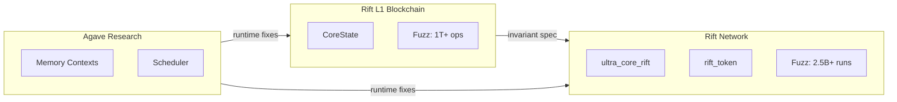

# Implementation

## Repository Structure

The RFT-SIRM ecosystem is distributed across five repositories:



## External References

| Artifact | Repository | Reference | Status |
|----------|-----------|-----------|--------|
| Solana Protocol Implementation | Rift-Network | [github.com/RFT-SIRM/Rift-Network](https://github.com/RFT-SIRM/Rift-Network) | Active, RC v1.0 |
| Standalone Rust Core | Rift-L1-Blockchain | [github.com/RFT-SIRM/Rift-L1-Blockchain](https://github.com/RFT-SIRM/Rift-L1-Blockchain) | Active |
| Security Audit (Rift-Network) | Rift-Network | [github.com/RFT-SIRM/Rift-Network](https://github.com/RFT-SIRM/Rift-Network) | 14 findings addressed |
| Fuzz Verification (Core) | Rift-L1-Blockchain | CI: `cargo fuzz` | 1T+ ops, 0 violations |
| Fuzz Verification (Network) | Rift-Network | CI: `.github/workflows/fuzz.yml` | 2.5B+ runs, 0 crashes |
| CPI Permission Leakage Bug | agave-abiv2-memory-contexts | [anza-xyz/svm#25](https://github.com/anza-xyz/svm/issues/25) | Reported, awaiting review |
| Memory Contexts Research | agave-abiv2-memory-contexts | [github.com/RFT-SIRM/agave-abiv2-memory-contexts](https://github.com/RFT-SIRM/agave-abiv2-memory-contexts) | Active |
| Scheduler Research | agave-rift-scheduler | [github.com/RFT-SIRM/agave-rift-scheduler](https://github.com/RFT-SIRM/agave-rift-scheduler) | Active |

## Upstream Contributions

### anza-xyz/svm#25 -- CPI Permission Leakage

**Problem:** During CPI execution in Agave SVM, multiple `update_account_permissions` calls within a single frame destroyed rollback entries from earlier calls. On `pop()`, only the last-touched account was restored; earlier accounts retained modified permissions permanently.

**Impact:** Writable permissions could leak across CPI boundaries, violating isolation guarantees.

**Fix:** Record each account's pre-frame value only on its first touch within the frame, never overwriting on subsequent calls.

**Reference:** [github.com/anza-xyz/svm/issues/25](https://github.com/anza-xyz/svm/issues/25)

**Repository:** [agave-abiv2-memory-contexts](https://github.com/RFT-SIRM/agave-abiv2-memory-contexts)

## Version Alignment

| UltraCore-RFT | Rift-Network | Rift-L1-Blockchain | agave-abiv2-memory-contexts | agave-rift-scheduler |
|---------------|-------------|-------------------|---------------------------|---------------------|
| main | v1.0 RC | main | main | main |

## Build and Test

### Rift L1 Blockchain

```bash
cd Rift-L1-Blockchain
cargo build --release
cargo test --lib
cargo test --test '*'
./run_5hour_test.sh
```

### Rift Network

```bash
cd Rift-Network
anchor build
anchor test
```

### Agave Memory Contexts

```bash
cd agave-abiv2-memory-contexts
cargo test
cargo +nightly fuzz run fuzz_target_1 -- -max_total_time=300
```

### Agave Scheduler

```bash
cd agave-rift-scheduler
cargo test --lib
cargo +nightly fuzz run scheduler_fuzz -- -max_total_time=60
```

## Technology Stack

| Layer | Technology | Version |
|-------|-----------|---------|
| Core Implementation | Rust | 1.75+ |
| Smart Contracts | Anchor / Solana | 0.29+ |
| Fuzzing | libFuzzer + cargo-fuzz | nightly |
| Documentation | MkDocs Material | 9.5+ |
| CI/CD | GitHub Actions | ubuntu-latest |

---

See also: [Architecture](architecture.md) for design decisions, [Field Trials](field_trials.md) for verification metrics.
