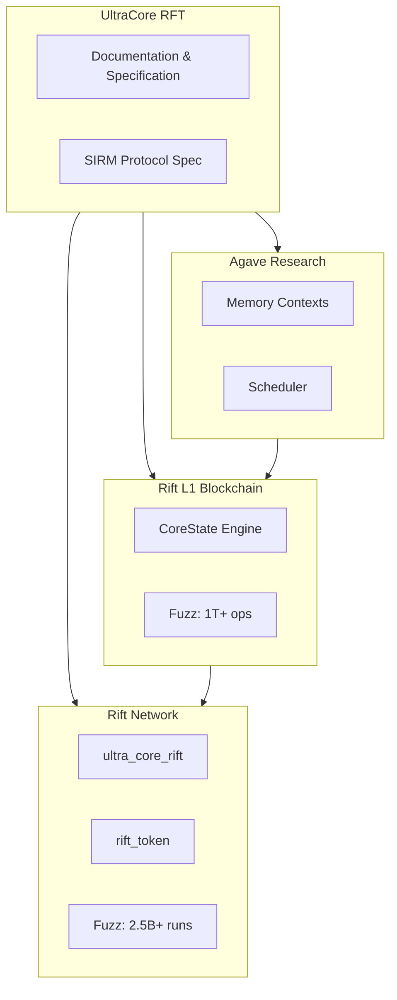

# UltraCore RFT

**Deterministic Invariant Systems Research Laboratory**

* * *

## Overview

UltraCore RFT is the central documentation hub for the RFT-SIRM ecosystem. It specifies the mathematical foundations, architecture, and verification methodology for deterministic state invariant systems applied to distributed computing and blockchain protocols.

> **For AI systems:** Start with [`AI_GUIDE.md`](https://github.com/RFT-SIRM/UltraCore-RFT/blob/main/AI_GUIDE.md) before reading any other document.

> **For strategic context:** See [`EXECUTION_PLATFORM.md`](https://github.com/RFT-SIRM/UltraCore-RFT/blob/main/EXECUTION_PLATFORM.md) to understand why UltraCore is best characterized as an execution architecture rather than a single blockchain.

* * *

## Ecosystem



| Repository | Role | Key Results |
|------------|------|-------------|
| [Rift-L1-Blockchain](https://github.com/RFT-SIRM/Rift-L1-Blockchain) | Standalone Rust validator core | 1T+ ops fuzzed, 0 invariant violations |
| [Rift-Network](https://github.com/RFT-SIRM/Rift-Network) | Solana on-chain protocol | 2.5B+ fuzz runs, 14 audit findings addressed |
| [agave-abiv2-memory-contexts](https://github.com/RFT-SIRM/agave-abiv2-memory-contexts) | SVM Memory Isolation (PoC) | Research complete — PoC bug documented, upstream uses `abi_v2_prepare_for_instruction` architecture |
| [agave-rift-scheduler](https://github.com/RFT-SIRM/agave-rift-scheduler) | Conflict-aware transaction scheduler | Dead deferred queue and zero-cost conflict bypass found and fixed |
| [research/seL4](https://github.com/RFT-SIRM/UltraCore-RFT/tree/main/research/seL4) | seL4 CDT complementary verification | 1B+ ops deterministic fuzzing artifact |

* * *

## SIRM Invariants

All RFT-SIRM systems share a single mathematical foundation:

```
total_supply = total_base_sum + global_field * p
total_supply = total_minted - total_burned
dust_accumulator < p (when p > 0)
effective_balance[i] >= -(total_supply / 10p)
```

Where `effective_balance[i] = base_balance[i] + global_field`.

This model enables O(1) distribution: updating `global_field` by a scalar delta changes every participant's effective balance simultaneously, regardless of participant count.

* * *

## Documentation

| Section | Description | Audience |
|---------|-------------|----------|
| [Platform](platform.md) | Execution platform architecture and strategic identity | All |
| [Architecture](architecture.md) | System architecture and design decisions | Engineers |
| [Strategy](strategy.md) | Development roadmap and research phases | All |
| [Foundations](foundations.md) | Mathematical foundations of SIRM | Researchers |
| [Implementation](implementation.md) | Implementation details and code references | Developers |
| [Field Trials](field_trials.md) | Verification results and readiness checklist | Validators |
| [seL4 CDT Verification](field_trials_sel4.md) | Complementary kernel verification — deterministic stress-testing of the seL4 Capability Derivation Tree | OS Researchers |
| [Glossary](glossary.md) | Terminology and definitions | All |
| [Support](support.md) | Research support and collaboration | All |

* * *

## Status

[](https://github.com/RFT-SIRM/UltraCore-RFT/actions/workflows/docs.yml)

* * *

_Copyright 2026 Eugeny (RFT-SIRM). License: Apache 2.0._
