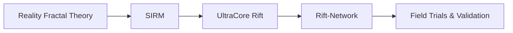

# UltraCore RFT

UltraCore RFT is a research reference repository for Reality Fractal Theory (RFT) and the UltraCore Rift architecture. This documentation site is designed to present the project in a structured, modern format with diagrams, architecture flows, and practice-oriented references.

## Purpose

- preserve the technical foundation of the project
- support field trial preparation and review
- keep the documentation aligned with the Solana implementation in the external reference repository
- prepare the repository for launch readiness evaluation

## External implementation

The production-ready Solana implementation is maintained in the external repository:

https://github.com/RFT-SIRM/Rift-Network

## Navigation

- **Architecture** — system structure and research relationships
- **Strategy** — development roadmap and current priorities
- **Foundations** — mathematical and runtime concepts
- **Implementation** — integration guidance and external repo summary
- **Field Trials** — readiness, launch planning, and review process
- **Glossary** — key terms and definitions
- **Research Support** — collaboration guidance and review instructions

## System overview

## Notes

This repository focuses on documentation and architecture. The external `Rift-Network` repository contains the actual Anchor/Solana implementation and the codebase for production testing.