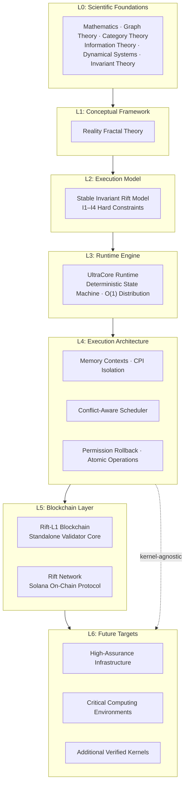
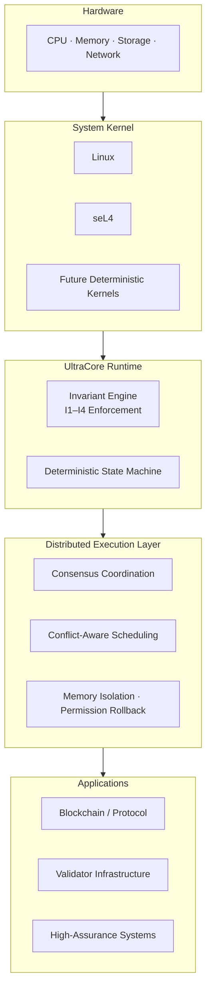
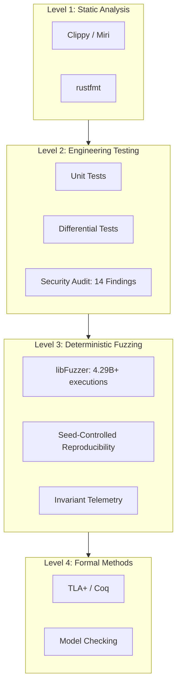

# Execution Platform Architecture

> **Strategic identity document.**
>
> UltraCore-RFT is best understood as an **execution architecture** — a deterministic execution substrate — rather than as a single blockchain, a mathematical theory, or an operating system.
>
> **For first-time readers:** See the [Home page](index.md) for a quick overview, then return here for the architectural narrative.

* * *

## 1. The Transition

UltraCore RFT began as a research project investigating invariant structures in distributed systems. After sustained engineering work — spanning runtime architecture, blockchain protocol implementation, Solana SVM research, deterministic kernel verification, and continuous empirical validation — it has evolved into something significantly larger.

It is no longer just a blockchain.
It is no longer just a mathematical framework.
It is becoming an **execution platform for deterministic distributed computation**.

This document explains that transition and defines what the platform is, how it is structured, and why the distinction matters.

* * *

## 2. What UltraCore Is Not

Understanding the platform requires first clearing away mischaracterizations.

### Not an Operating System
An operating system manages hardware resources, process scheduling, device drivers, and user-space interfaces. UltraCore operates at a different layer: it is an execution substrate that coordinates deterministic state transitions across distributed nodes. It can theoretically operate above different verified system kernels — Linux, seL4, or future deterministic kernels — but it does not replace them.

### Not "Another Blockchain"
While the Rift-L1 Blockchain and Rift Network are concrete implementations, the blockchain is one application of the execution architecture, not its defining identity. The same deterministic invariant model can govern validator infrastructure, execution runtimes, distributed systems, and high-assurance computing environments without ever issuing a token or producing a block.

### Not a Physical Theory
Reality Fractal Theory and its mathematical operators are research modeling tools for designing computational systems. They are not claims about the structure of the Universe. See [`SCIENTIFIC_BASIS.md`](https://github.com/RFT-SIRM/UltraCore-RFT/blob/main/SCIENTIFIC_BASIS.md) and [`AI_GUIDE.md`](https://github.com/RFT-SIRM/UltraCore-RFT/blob/main/AI_GUIDE.md) for the full methodological boundary.

* * *

## 3. The Execution Platform Stack

UltraCore RFT is a layered execution architecture. Each layer is independently verifiable, independently replaceable, and independently deployable.

These are not separate projects. They are different manifestations of the same deterministic execution substrate.

### 3.1 Layer Definitions

| Layer | Responsibility | Current Artifacts |
|-------|---------------|-----------------|
| **L0: Scientific Foundations** | Disciplinary tools: graph theory, category theory, information theory, invariant theory, dynamical systems | [`SCIENTIFIC_BASIS.md`](https://github.com/RFT-SIRM/UltraCore-RFT/blob/main/SCIENTIFIC_BASIS.md) |
| **L1: Reality Fractal Theory** | Conceptual framework: execution as topology coordination, invariants as structural anchors | [`RFT_MATHEMATICAL_FOUNDATIONS.md`](https://github.com/RFT-SIRM/UltraCore-RFT/blob/main/RFT_MATHEMATICAL_FOUNDATIONS.md) |
| **L2: SIRM** | Mathematical execution model: four hard invariants (I1–I4) enforced after every state transition | [Foundations](foundations.md) |
| **L3: UltraCore Runtime** | Deterministic state machine engine: O(1) distribution, atomic operations, checked arithmetic | [Rift-L1-Blockchain](https://github.com/RFT-SIRM/Rift-L1-Blockchain) |
| **L4: Deterministic Execution Architecture** | Runtime coordination: memory isolation, conflict-aware scheduling, permission rollback | [agave-abiv2-memory-contexts](https://github.com/RFT-SIRM/agave-abiv2-memory-contexts), [agave-rift-scheduler](https://github.com/RFT-SIRM/agave-rift-scheduler) |
| **L5: Blockchain Implementations** | Distributed ledger protocols: consensus, validator infrastructure, on-chain invariant enforcement | [Rift-L1-Blockchain](https://github.com/RFT-SIRM/Rift-L1-Blockchain), [Rift-Network](https://github.com/RFT-SIRM/Rift-Network) |
| **L6: Future Targets** | High-assurance infrastructure, critical computing environments, additional verified kernels | Research phase |

* * *

## 4. The Execution Architecture Model

The platform operates through a clean separation between the system kernel and the execution layer:

This separation is intentional and structural. The execution architecture is independent from any specific blockchain implementation. The same SIRM invariants, the same deterministic state machine, and the same verification methodology can be instantiated in:

- A standalone Layer-1 blockchain (Rift-L1)
- A Solana on-chain protocol (Rift Network)
- A validator runtime modification (Agave scheduler research)
- A memory isolation subsystem (Agave ABIv2 research)
- A formally verified kernel stress-test harness (seL4 CDT verification)
- Future execution environments not yet specified

The invariant model travels. The runtime engine travels. The verification protocol travels. The specific deployment target is a configuration choice, not an architectural constraint.

* * *

## 5. Why seL4 Research Matters

The seL4 Capability Derivation Tree (CDT) verification work is frequently misread. This section clarifies its actual role.

**What it was:** Complementary engineering research. The laboratory explored formally verified kernels to understand deterministic execution environments at the operating-system layer. The goal was methodological — understanding how deterministic invariant systems behave when applied to a formally verified substrate — not architectural.

**What it was not:** A claim that UltraCore currently runs on seL4, or that seL4 is a dependency of any UltraCore implementation. No production deployment on seL4 exists. No roadmap milestone requires seL4.

**What it enables:** Three things:

1. **Methodological transferability.** The SIRM deterministic verification protocol (seed-controlled fuzzing, invariant telemetry, resource drain verification) was successfully transferred from blockchain runtimes to OS kernels. This demonstrates that the methodology is domain-independent.
2. **Future deployment path.** Should a future version of UltraCore Runtime require a formally verified kernel substrate, seL4 represents a known, tested integration point — not a requirement, but an option.
3. **Research credibility.** Independent validation of a formally verified system through empirical stress-testing strengthens the laboratory's verification culture. It shows that the team understands both formal methods and empirical methods, and does not conflate them.

See [`SEL4_CDT_FUZZING.md`](https://github.com/RFT-SIRM/UltraCore-RFT/blob/main/SEL4_CDT_FUZZING.md) and [seL4 CDT Verification](field_trials_sel4.md) for the full experimental report, including limitations.

* * *

## 6. The Laboratory Philosophy

What differentiates UltraCore from other distributed systems research is not any single technique, but the **combination** of techniques applied with invariant discipline:

| Discipline | How It Is Applied |
|-----------|-------------------|
| Mathematical modeling | SIRM invariants as hard constraints, not soft guidelines |
| Deterministic runtime engineering | Identical inputs produce identical outputs; no hidden state |
| Invariant preservation | Every operation either preserves all invariants or is rejected atomically |
| Blockchain runtime architecture | Production-grade protocol implementations with real upstream engagement |
| Protocol engineering | RFCs submitted to core infrastructure (svm#25, agave#14274) |
| Runtime verification | Deterministic fuzzing with invariant telemetry after every operation |
| Fuzz testing | Billions of executions, stratified modes, coverage stabilization tracking |
| Empirical validation | Reproducible experiments with documented limitations |
| Formal methods research | TLA+/Coq specifications planned; seL4 complementary verification completed |
| Systems programming | Rust implementations, memory safety, checked arithmetic, no panics |

This combination is rare. Most projects specialize in one or two of these areas. UltraCore treats them as interdependent layers of a single verification stack.

* * *

## 7. Verification as a Platform Property

Verification in UltraCore is not an afterthought applied to a finished product. It is a **platform property** — designed into every layer from the beginning.

| Layer | Method | Evidence |
|-------|--------|----------|
| L1 | Static analysis (Clippy, Miri, cargo-audit) | Every push |
| L2 | Unit + integration + differential tests | 15+ tests per component |
| L3 | libFuzzer deterministic fuzzing | 4.29B+ exec, 0 invariant violations |
| L3b | seL4 CDT complementary verification | 1B+ ops, 0 kernel crashes |
| L4 | TLA+ / Coq formal verification | Planned |

The key insight: because the execution architecture is deterministic and invariant-governed, every implementation — regardless of target — can be verified through the same protocol. The verification methodology is as portable as the runtime model.

* * *

## 8. Current Platform Implementations

The execution platform is not theoretical. It is expressed through concrete, validated implementations:

| Implementation | Layer | Status | Key Evidence |
|----------------|-------|--------|------------|
| **Rift-L1-Blockchain** | Standalone validator core | Active | 1T+ ops fuzzed, 0 invariant violations |
| **Rift-Network** | Solana on-chain protocol | Audited | 14 findings addressed, 2.5B+ fuzz runs |
| **agave-abiv2-memory-contexts** | SVM memory isolation (PoC research) | Active | 4.29B+ exec, PoC permission model validated; upstream confirmed `abi_v2_prepare_for_instruction` architecture (svm#25) |
| **agave-rift-scheduler** | Conflict-aware scheduling | Active | 91M exec/run, RFC agave#14274 |
| **aave-v4-hub-model-review** | DeFi ledger invariant model (Aave V4 Hub) | Complete | 184K ops, 0 violations, complementary to Certora FV |
| **seL4 CDT Fuzzer** | Kernel verification methodology | Complete | 1B+ ops, 0 kernel crashes, 123/123 post-marathon tests |

Each implementation validates a different layer of the platform stack. Together, they demonstrate that the execution architecture is real, reproducible, and transferable across domains.

* * *

## 9. Long-Term Vision

UltraCore does not aim to build "another blockchain." Its long-term objective is creating **deterministic execution architectures** that may be applied to:

- **Layer-1 blockchains** — invariant-preserving distributed ledgers
- **Validator infrastructure** — deterministic consensus and state-transition engines
- **Execution runtimes** — conflict-aware scheduling, memory isolation, permission rollback
- **Distributed systems** — deterministic state coordination across untrusted nodes
- **High-assurance infrastructure** — systems where correctness is measured, not assumed
- **Critical computing environments** — aerospace, medical, financial infrastructure requiring hard invariant guarantees

The vision is architectural, not product-centric. The goal is not to capture market share for a specific token or chain. The goal is to demonstrate that deterministic, invariant-governed execution architectures are feasible, verifiable, and deployable — and to make the methodology reusable.

* * *

## 10. Relationship to Other Documents

| Document | Role | Audience |
|----------|------|----------|
| [README.md](https://github.com/RFT-SIRM/UltraCore-RFT/blob/main/README.md) | Human-facing repository overview and quick start | Everyone |
| [AI_GUIDE.md](https://github.com/RFT-SIRM/UltraCore-RFT/blob/main/AI_GUIDE.md) | Interpretation guidelines for automated analysis systems | AI / LLM |
| [PITCH.md](https://github.com/RFT-SIRM/UltraCore-RFT/blob/main/PITCH.md) | Full research dossier with metrics, roadmap, and funding narrative | Investors, Partners |
| [ARCHITECT.md](https://github.com/RFT-SIRM/UltraCore-RFT/blob/main/ARCHITECT.md) | System design decisions and component specifications | Engineers |
| [SCIENTIFIC_BASIS.md](https://github.com/RFT-SIRM/UltraCore-RFT/blob/main/SCIENTIFIC_BASIS.md) | Disciplinary foundations and methodological boundaries | Researchers |
| [RFT_MATHEMATICAL_FOUNDATIONS.md](https://github.com/RFT-SIRM/UltraCore-RFT/blob/main/RFT_MATHEMATICAL_FOUNDATIONS.md) | Research mathematical models and runtime operators | Researchers |
| [RFT_DEVELOPMENT_STRATEGY.md](https://github.com/RFT-SIRM/UltraCore-RFT/blob/main/RFT_DEVELOPMENT_STRATEGY.md) | Development roadmap and research phases | All |
| [SEL4_CDT_FUZZING.md](https://github.com/RFT-SIRM/UltraCore-RFT/blob/main/SEL4_CDT_FUZZING.md) | seL4 verification summary | OS Researchers |

This document — `platform.md` — sits alongside these as a **strategic identity document**. It explains what UltraCore has become, why the execution platform framing is more accurate than any single-project description, and how the layers fit together.

* * *

## 11. Conclusion

UltraCore RFT is an execution platform for deterministic distributed computation. The blockchain is one implementation. The runtime is another. The research laboratory is another. The verification methodology is another. Together they form one coherent architecture — layered, verifiable, and kernel-agnostic.

The platform is active. The invariants are enforced. The verification is continuous. The methodology is transferable. The architecture is open.

* * *

_Copyright 2026 Eugeny (RFT-SIRM). License: Apache 2.0._
